# learn-crossplane — AWS + Crossplane DevOps Platform on LocalStack

A complete end-to-end, Kubernetes-native DevOps pipeline **running entirely on a local machine**: infrastructure declared as Kubernetes custom resources with **Crossplane** and continuously reconciled, CI with **Jenkins** configured entirely from git (JCasC), pull-based CD with **ArgoCD**, six microservices running on EKS, served via ALB → CloudFront → Route53, and observed with **OpenTelemetry + SigNoz**. All AWS services are emulated using **LocalStack Pro**, requiring zero cloud costs.

This is the second lab in a pair. The first, `learn-opensible`, builds the same platform with OpenTofu + Ansible + AWS CodeBuild. Where the two differ this README says so — those differences are the point of the exercise, and [§6.1](#61-crossplane--localstack) is the honest list of places where Crossplane made things *harder* than Terraform did.

This repository also documents areas where LocalStack behaves **differently** from real AWS — see [§6](#6-localstack-limitations) and [§7](#7-migrating-to-real-aws).

---

## 0. One-Page Architecture

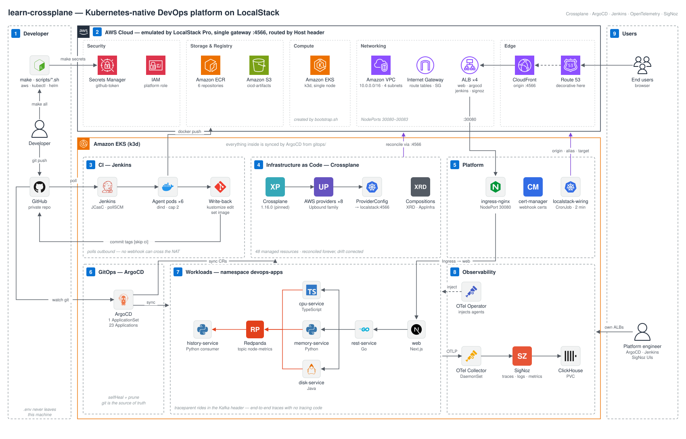

Read the flows in order:

1. **Bootstrap** — `make all` runs the six imperative steps (cluster, Crossplane, providers, ArgoCD, secrets, ApplicationSet). [§3.4](#34-what-runs-imperatively-and-why) explains which parts cannot be GitOps, and why.
2. **IaC** — ArgoCD syncs `gitops/infrastructure/`; Crossplane reconciles it into LocalStack and corrects drift, forever.
3. **CI/CD** — Jenkins polls git, builds and pushes images to ECR, then **writes the new tags back to git**; ArgoCD deploys them.
4. **Request** — browser → CloudFront → ALB → ingress-nginx → web / rest-service → the metric services → Redpanda.
5. **Telemetry** — all pods → Collector → SigNoz; applications remain backend-agnostic.

---

## 1. Components

| Component | Address | Role |
| :--- | :--- | :--- |
| **Makefile + `scripts/`** | (host) | The whole imperative surface: `up`, `secrets`, `bootstrap`, `status`, `verify`, `destroy` |
| **LocalStack Pro** | `http://localhost:4566` | Emulated AWS gateway, routes by `Host` header |
| | `localhost:4510-4559` | External service port range (EKS API, ECR…) |
| **Crossplane 1.16.0** | namespace `crossplane-system` | IaC control plane: 8 Upbound AWS providers reconcile `gitops/infrastructure/` |
| **ArgoCD v2.13.2** | own ALB, NodePort 30081 | GitOps engine — one ApplicationSet discovers every `config.yaml` |
| **Jenkins** | own ALB, NodePort 30082 | CI — controller + JCasC, builds in throwaway agent pods |
| **SigNoz** | own ALB, NodePort 30083 | Observability backend (traces · logs · metrics · k8s) |

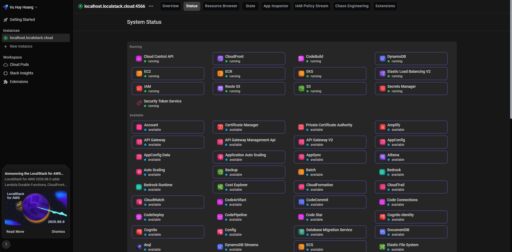

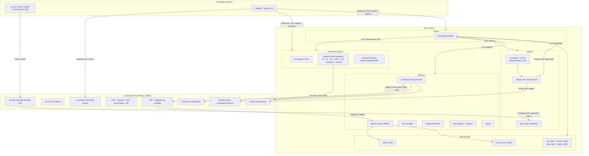

### 1.1 Repository Structure

Four top-level concerns, each answering a single question:

```
learn-crossplane/
├── apps/        "What do applications do?"            Source code + Dockerfiles, 6 images, 4 languages
├── gitops/      "How should AWS and the cluster look?" Crossplane CRs + platform + workloads — consumed by ArgoCD
├── Jenkinsfile  "How does a commit become an image?"  CI pipeline
└── scripts/     "What cannot be GitOps?"              Bootstrap only — see §3.4
```

In full:

```
learn-crossplane/
├── apps/                                Source and Dockerfiles (6 microservices)
│   ├── web/                             Next.js 14 frontend        node:20-alpine    :3000
│   ├── rest-service/                    Go API gateway             distroless        :4000
│   ├── cpu-service/                     TypeScript / Node          node:20-alpine    :4001
│   ├── memory-service/                  Python                     python:3.12-slim  :4002
│   ├── disk-service/                    Java / Maven               temurin:21-jre    :4003
│   └── history-service/                 Python Kafka consumer      python:3.12-slim  :4004
├── gitops/                              GitOps single source of truth
│   ├── bootstrap/                       Applied once, by scripts/bootstrap.sh
│   │   ├── argocd/                      ArgoCD v2.13.2
│   │   └── appset.yaml                  the one ApplicationSet, discovers every config.yaml
│   ├── infrastructure/                  Crossplane managed resources
│   │   ├── provider/                    wave 1   Upbound providers, credentials, ProviderConfig
│   │   ├── iam/                         wave 1   platform role and policy
│   │   ├── compositions/                wave 1   XRD, Composition, example claim
│   │   ├── networking/                  wave 2   VPC, subnets, IGW, route tables, SG + rules
│   │   ├── storage/                     wave 2   S3 artifacts bucket (versioning, SSE, lifecycle)
│   │   ├── registry/                    wave 2   6 ECR repositories + lifecycle policies
│   │   ├── loadbalancer/                wave 2   4 ALBs: web :30080, argocd :30081, jenkins :30082, signoz :30083
│   │   └── cdn-dns/                     wave 3   CloudFront, Route53 zone and record
│   ├── platform/
│   │   ├── ingress-nginx/               wave 0   NodePort 30080
│   │   ├── localstack-wiring/           wave 4   CronJob: ALB target + CF/Route53 wiring
│   │   ├── cert-manager/                wave 5   issues the OTel operator webhook cert
│   │   ├── jenkins/                     wave 8   controller + JCasC + agent RBAC (no chart, plain manifests)
│   │   ├── redpanda/                    wave 12  Kafka-compatible queue
│   │   ├── otel-operator/               wave 15  injects auto-instrumentation agents
│   │   ├── signoz/                      wave 22  observability backend
│   │   └── otel-collector/              wave 24  cluster telemetry pipeline
│   └── workloads/
│       ├── _shared/                     wave 30  Namespace, Ingress, Instrumentation
│       └── <service>/                   wave 35  Deployment, Service, Kustomization
├── scripts/                             Four lifecycle files plus one read-only diagnostic. §3.4
│   ├── lib.sh                           Sourced by all: loads .env, anchors cwd, aws_() helper
│   ├── secrets.sh                       GITHUB_TOKEN into AWS Secrets Manager
│   ├── bootstrap.sh                     Cluster, Crossplane, providers, ArgoCD, ApplicationSet
│   ├── destroy.sh                       Teardown (--purge-data for a clean slate)
│   └── verify-web-access.sh             Endpoints, credentials, ALB target health (read-only)
├── project-images/                      Diagrams and screenshots used by this README
├── Jenkinsfile                          CI pipeline: checkout, 6 parallel builds, write-back
├── docker-compose.yml                   LocalStack Pro
├── Makefile                             One-command lifecycle
└── PROJECT_RULES.md                     Safety rules and the CRD-pruning traps
```

Each directory under `infrastructure/`, `platform/` and `workloads/` contains a `config.yaml` specifying five fields:
`name`, `namespace`, **`manifestPath`**, `syncWave`, `prune`. The ApplicationSet scans `gitops/infrastructure/*/config.yaml`, `gitops/platform/*/config.yaml` and `gitops/workloads/*/config.yaml`, generating an `Application` for each — 23 in total.

> **Why `manifestPath` instead of `path`.** `path` is a **reserved keyword** in the git files generator — it automatically injects an *object* (`basename`, `filename`, `path`, `segments`) and overrides user values. `spec.source.path` then renders as `"map[basename:... filename:config.yaml ...]"`; Applications sit at `SYNC: Unknown` while **HEALTH remains `Healthy`**, with no error output.

Result: **adding a component = creating a directory + a five-field `config.yaml`.** No script edit, no hand-written `Application`.

**New to Crossplane?** [§13](#13-crossplane-from-the-ground-up) explains which AWS service each file under `gitops/infrastructure/` configures, how a YAML file becomes an AWS resource, and how the whole thing is authorized.

---

## 2. Getting Started

Prerequisites:

- Docker Desktop
- A **LocalStack Pro** auth token — EKS, ECR and CloudFront are Pro-only
- A **GitHub PAT with `repo` write scope** — the pipeline pushes image tags back to `gitops/workloads/`
- `awscli`, `kubectl`, `helm`, `git`, `curl`
- A POSIX shell. On Windows use Git Bash or WSL — the scripts are bash, not PowerShell.

```bash
# Create .env from template and configure credentials
cp .env.example .env
```

```bash
# .env
LOCALSTACK_PAT=<localstack auth token>
GITHUB_TOKEN=<github token with write permissions>
```

Then push this repository to GitHub. **ArgoCD and Jenkins both clone from GitHub, never from your working copy** — the repo URL is set in `gitops/bootstrap/appset.yaml`, `casc/jenkins.yaml` and `scripts/lib.sh`. Local edits do nothing until they are pushed.

```bash
make all      # up → secrets → bootstrap
```

**`.env` is the ingestion source, not what the cluster reads from.** `make secrets` moves `GITHUB_TOKEN` into AWS Secrets Manager; `make bootstrap` reads it back from there and materialises it in the cluster. Nothing else references `.env`. Details in [§8](#8-secrets-management).

> `.env` is ignored by git (`.gitignore`) to ensure sensitive tokens and credentials are never committed. Use `.env.example` as a template when setting up new environments.

> **This lab and `learn-opensible` are mutually exclusive.** Both declare `container_name: localstack` and both publish 4566 plus 4510-4559. Switching labs: `docker compose down` in the *other* project directory first. Each lab keeps its own `./data/localstack`, so switching back loses nothing.

Next, follow the workflow described in [§3](#3-workflows).

> **Regarding state persistence:** `PERSISTENCE=1` is enabled (see `docker-compose.yml`), allowing emulated resources to survive container restarts. A cold start downloads k3d (5-15 min until EKS is ACTIVE) plus eight 200-400 MB provider images pulled serially (15-20 min) — budget 20-35 minutes the first time.
>
> If emulated resources diverge significantly from git manifests, reset with `make purge` and re-run `make all`.

---

## 3. Workflows

```bash
make all      # everything below, in order
```

Or step by step:

```bash
make up          # 1. start LocalStack Pro
make secrets     # 2. GITHUB_TOKEN into Secrets Manager (refreshes the in-cluster copy too)
make bootstrap   # 3. cluster, Crossplane, providers, ArgoCD, ApplicationSet
```

That is the whole lifecycle. After step 3 nothing else is imperative: ArgoCD syncs everything under `gitops/`, and the `localstack-wiring` CronJob handles the pieces of state that need runtime values. There is no step to remember after the ALB appears.

### 3.1 `make up` — Start LocalStack

`docker compose up -d localstack`. Every later step also starts it and waits on `/_localstack/health`, so running this by hand is optional.

### 3.2 `make secrets` — Secret Ingestion

Pushes the GitHub PAT to AWS Secrets Manager as `learn-crossplane/github-token`. Must run **before `make bootstrap`**, which reads the token back to build the in-cluster credentials. Re-run as needed for rotation — if the cluster is already up, it refreshes the in-cluster `git-credentials` Secret in the same run. Details in [§8](#8-secrets-management).

### 3.3 `make bootstrap` — Cluster and GitOps Handover

`scripts/bootstrap.sh`, idempotent — re-running it is the recovery path when a step failed halfway, and it is how a rotated token reaches ArgoCD.

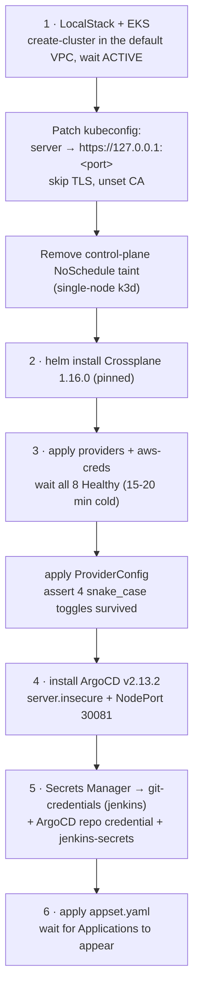

Watching it converge (the slowest link is Crossplane reconciling the VPC, subnets and security group before the ALB can exist):

```bash
make status      # providers, managed resources, applications, pods, CI, entry URLs
```

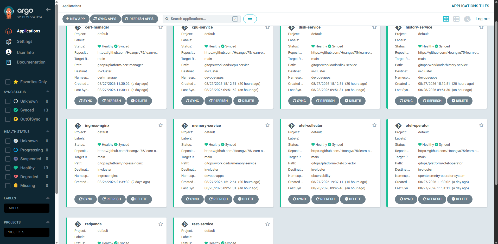

### 3.4 What runs imperatively, and why

`scripts/` holds four lifecycle files, two of which are a library and a teardown, plus one read-only diagnostic. That is deliberate, and the test applied to every candidate was: **could a controller already running in the cluster do this instead?** If yes, it belongs in `gitops/` and it is not a script.

Two things failed that test for a long time and have since moved into the cluster as the `localstack-wiring` CronJob: ALB target registration and the CloudFront/Route53 wiring. Both need values that only exist at runtime, which is why they started out as scripts — but "needs a runtime value" argues for a *controller*, not for a script you have to remember to re-run. As a CronJob they are declared in git, versioned with everything else, and self-healing on a two-minute loop.

What is left cannot move, because of a chicken-and-egg problem rather than convenience:

| Step | Why not GitOps |
| :--- | :--- |
| EKS cluster | Nothing can run in-cluster before a cluster exists. |
| ArgoCD install | The bootstrap paradox: ArgoCD cannot sync its own installation. |
| Crossplane + providers | The `ProviderConfig` CRD ships *inside* the provider package. Until the package is Healthy the kind does not exist, and any Application referencing it fails, so the cold start waits on `condition=Healthy` before applying. ArgoCD adopts the directory afterwards, which is what gives it self-heal. |
| `git-credentials` Secret | Read from Secrets Manager. A token in git is a token published. |

And what moved into the cluster:

| Now handled by | Job |
| :--- | :--- |
| `gitops/platform/localstack-wiring/` | Registers `<node-ip>:30080` in the ALB target group (k3d gives the node a new IP on every recreation), patches the CloudFront origin and Route53 alias from the ALB status, and re-asserts that the ProviderConfig toggles survived schema validation. Every two minutes, comparing before every write. |

Everything else is discovered from `gitops/` by the ApplicationSet.

**On prune and blast radius.** Each `config.yaml` sets `prune` per component. `ingress-nginx` and `infrastructure/provider` use `prune: false` — pruning either takes down the whole cluster network or the whole IaC control plane. The `devops-apps` Namespace instead carries a resource-level `argocd.argoproj.io/sync-options: Prune=false`, so the Ingress and Instrumentation next to it still prune normally. Disabling prune for a whole Application to protect one resource is the wrong level: it deadlocks an Ingress rename against the nginx admission webhook.

**On sync waves.** The numbers in [§1.1](#11-repository-structure) document intent; they do not enforce it. `sync-wave` orders resources only when a *parent* Application syncs its children (app-of-apps). The ApplicationSet controller creates all Applications simultaneously, so what actually produces convergence is the `retry` block in the appset plus the fact that `bootstrap.sh` installs Crossplane before ArgoCD exists. Waves *within* a single Application work normally.

> Note on templating: `prune` is a **boolean** field in CRDs. Placing `prune: {{ .prune }}` directly in YAML templates causes parsing failures (`found unhashable key`). The solution is `templatePatch`: rendered as a **string** and merged on top of generated `Application` resources.

### 3.5 `Jenkinsfile` — CI Pipeline

One checkout, six parallel builds, one write-back:

```
                      ┌─ build-web ─────────────┐
                      ├─ build-cpu-service ─────┤
  Checkout ──────────►├─ build-memory-service ──┤──► Update GitOps manifests
                      ├─ build-disk-service ────┤
                      ├─ build-rest-service ────┤
                      └─ build-history-service ─┘
```

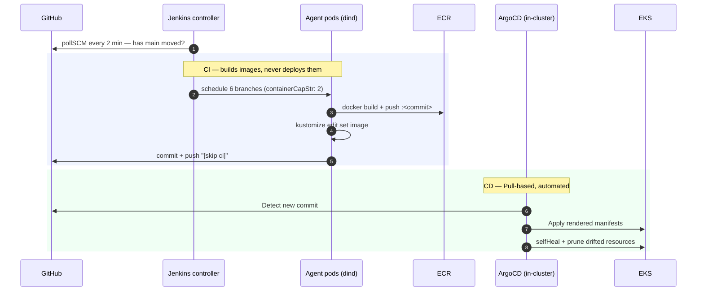

Each branch runs in its own throwaway pod with a privileged `dind` container and its own layer-cache PVC, so changing one service leaves the other five hitting cache.

**How many run at once is stated, not inferred.** `containerCapStr: "2"` in `gitops/platform/jenkins/casc/jenkins.yaml` caps the cloud at two agent pods. This is the clearest single improvement over the Tekton arrangement, and the reason is a failure worth keeping:

Tekton has no `maxConcurrency`, so the limit had to be smuggled in as a memory request — 3Gi apiece on a ~15.5Gi node admitted about four. Run `monorepo-ci-run-8pwbv` then split itself into a clean natural experiment:

```
4 pods started together at 05:57:02-03   ALL FOUR FAILED
2 pods started at 06:01:08-10, alone     BOTH SUCCEEDED
```

with every failure identical, and naming the wrong subsystem:

```
ERROR: failed to solve: node:20-alpine: failed to do request:
Head "https://registry-1.docker.io/v2/library/node/manifests/20-alpine":
net/http: TLS handshake timeout
```

Not MTU — the daemon logged `mtu: 1450` and it was correct. Four Docker-in-Docker daemons pulling base images at once, through LocalStack's DNS and Docker Desktop's NAT, cannot finish their TLS handshakes. The tell was in the trivial steps: `load .dockerignore` moved 2 bytes in 9.2 seconds. **The binding constraint is the network, and the throttle had been sized against memory.** Expressing it as a request meant the number could be wrong without anyone noticing until a whole pipeline died.

Three constraints carried over from Tekton unchanged, because they are properties of this environment rather than of the CI engine:

1. **`--insecure-registry`.** The ECR host is a four-label subdomain of `localhost.localstack.cloud`, and a TLS wildcard matches exactly one label, so LocalStack's certificate does not cover it. Docker tries HTTPS, fails verification, and will not fall back on its own. The k3d nodes do not hit this because LocalStack marks the registry insecure in their containerd config when it creates the cluster; a daemon started by hand inside a pod inherits none of that.
2. **`--mtu` read from `/sys/class/net/eth0/mtu`.** flannel VXLAN leaves the pod interface at 1450. dockerd defaults its bridge to 1500 and everything between 1451 and 1500 bytes is silently dropped. The symptom is deceptive: DNS answers instantly because queries are small UDP, while every TLS handshake and bulk transfer stalls — `npm ci` for `apps/web` once took 47 minutes and exited 0 with an empty `node_modules`.
3. **No `|| true` after `docker push`.** An earlier version ended in `docker push … || echo "pushed or simulated"`, which made every push failure a green build. Image tags were then written for images that did not exist, ArgoCD synced them, and the pods went `ImagePullBackOff` — three steps from the real error.

Key GitOps properties:

- **CI does not deploy.** The Jenkinsfile needs ECR push and git write access; it never runs `kubectl` against the workloads.
- **Desired state resides strictly in git.** `gitops/workloads/<service>/kustomization.yaml` is the single source of truth; rollbacks are handled via `git revert`.
- **Automated drift correction.** `selfHeal: true` reverts manual changes; `prune: true` deletes resources removed from git.

**The write-back is the handover from CI to CD.** The final stage runs `kustomize edit set image` in each `gitops/workloads/<service>/` directory and pushes the commit. ArgoCD watches git, not ECR, so an image nobody wrote a tag for is an image nobody deploys. It is deliberately all-or-nothing: it is only reached when all six builds succeeded, because writing a tag for an image that was never pushed is the failure above.

```
gitops/workloads/cpu-service/
├── config.yaml         ApplicationSet configuration
├── kustomization.yaml  namespace + images.newName/newTag  ← CI/CD handover point
├── deployment.yaml
├── service.yaml
└── rbac.yaml
```

### 3.6 Triggering — why polling, and why that is not a workaround

`pollSCM('H/2 * * * *')`, declared in the Job DSL inside `casc/jenkins.yaml`. Jenkins asks GitHub every two minutes whether `main` has moved. To skip the wait, `make run-ci` queues the job by hand.

**Why not a webhook.** Because a webhook cannot arrive. The cluster is a k3d container inside Docker Desktop inside WSL2 on a laptop behind NAT, and an inbound connection from GitHub would have to traverse:

```
GitHub → home IP → NAT router → Windows → WSL2 → Docker Desktop → k3d → 10.43.x
```

Nothing on that path forwards inbound. The previous engine was chosen partly to fix triggering: Tekton's `EventListener` was complete, healthy, and **had received zero events in nineteen hours of uptime**. The machinery was never the problem. Polling inverts the direction — only outbound connections, which NAT does not obstruct — and it is what ArgoCD in this same cluster has always done to detect git changes.

The cost is honest and small: up to one poll interval of latency instead of instant.

**To move to real webhooks**, put a tunnel in front of Jenkins (`cloudflared tunnel --url http://<jenkins-alb>:4566`), register the public URL as a webhook on the repo, and add the `github` plugin. Do not do that without authentication in front of it first.

**The loop, and why the filter is not optional.** The last stage pushes a commit to `main`. Polling would see that commit and build again, forever. Two things stop it and **both** are required:

- the commit message carries the skip marker;
- the SCM extension in `casc/jenkins.yaml` reads it:

```groovy
messageExclusion {
  excludedMessage('(?s).*\\[skip ci\\].*')
}
```

The marker alone is decoration, and the filter alone has nothing to match.

`(?s)` makes `.` match newlines, so the marker is tested against the **whole** message, exactly as GitHub's webhook payload would be. A commit that merely *discusses* the marker in its body is therefore also skipped — not a bug, and it has bitten this repo once already. See `PROJECT_RULES.md` rule 11.

**When a push produces no build**, the reason is in the job's polling log, not the build log:

```bash
kubectl -n jenkins exec deploy/jenkins -- \
  cat /var/jenkins_home/jobs/monorepo-ci/scm-polling.log
```

### 3.7 `make status` / `make verify` — Diagnostics

Both are read-only. Read them top to bottom; the first section that looks wrong is the one to fix, because everything below it depends on that one.

- **`make status`** — providers, `kubectl get managed`, ArgoCD Applications, workload pods, Jenkins, and the entry URLs. It reads the URLs out of the `localstack-wiring` log rather than querying AWS itself, so whatever it prints is what the last reconcile actually saw.
- **`make verify`** (`bash scripts/verify-web-access.sh`) — every endpoint read from the AWS API and probed, the ArgoCD and Jenkins credentials, ALB target health, and where the current build is. Kept as a script because `make` is not installed on every machine that runs this lab.

### 3.8 `make destroy` / `make purge` — Teardown

```bash
make destroy   # delete the cluster, stop the containers, KEEP ./data/localstack
make purge     # also delete ./data/localstack — prompts first
```

`make destroy` is not a clean slate. `PERSISTENCE=1` is set in `docker-compose.yml`, and `./data/localstack` is a bind mount that `docker compose down -v` does not touch, so every emulated resource comes back on the next `make up`. "I destroyed everything and the old ALB is still there" is this, and `make purge` is the answer.

---

## 4. Request Routing Flow

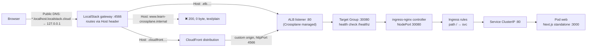

### 4.1 Architecture: ALB + Ingress-Nginx

Rather than running the AWS Load Balancer Controller inside LocalStack (which introduces OIDC, EC2 API mocking, and certificate validation complexities in local k3d environments), the project implements a standard **L4 ingress with L7 controller** architecture:

```
CloudFront → ALB (Crossplane) → ingress-nginx NodePort 30080 → Ingress rules → ClusterIP Service → Pod
```

- **Manifests remain identical on AWS.** `ingressClassName: nginx`, Ingress rules, and Services require no changes.
- [`gitops/workloads/_shared/ingress.yaml`](gitops/workloads/_shared/ingress.yaml) carries annotations for both `alb.ingress.kubernetes.io/*` and `nginx.ingress.kubernetes.io/*`.
- Ingress-Nginx manifests (`v1.11.3` baremetal) are vendored in [`gitops/platform/ingress-nginx/`](gitops/platform/ingress-nginx/) with static `nodePort: 30080` binding matching the target group in [`alb-web.yaml`](gitops/infrastructure/loadbalancer/alb-web.yaml).
- The node is registered in that target group by the `localstack-wiring` CronJob, not by a script — k3d gives the node a new IP on every recreation.

### 4.2 Endpoint URLs and Web UIs

Endpoints use public wildcard DNS under `localhost.localstack.cloud` resolving to `127.0.0.1`:

| Component | Address | How |
| :--- | :--- | :--- |
| **Web app via ALB** | `http://learn-crossplane-alb.elb.localhost.localstack.cloud:4566/` | NodePort 30080 |
| **Web app via CloudFront** | `http://<dist-id>.cloudfront.localhost.localstack.cloud:4566/` | origin patched by `localstack-wiring` |
| **ArgoCD** | `http://<argocd-alb-dns>:4566/` | its own ALB, NodePort 30081 — user `admin`, password from `make verify`. `kubectl -n argocd port-forward svc/argocd-server 8080:80` also works. |
| **Jenkins** | `http://<jenkins-alb-dns>:4566/` | its own ALB, NodePort 30082 — user `admin`, password from `make verify`. `kubectl -n jenkins port-forward svc/jenkins 8080:8080` also works. |
| **SigNoz** | `http://<signoz-alb-dns>:4566/` | its own ALB, NodePort 30083. No generated password: the first visit asks you to create an account. |
| **LocalStack gateway** | `http://localhost:4566` | |

Every address above except the first is assigned by LocalStack at creation time and changes whenever the emulated resources are recreated, so do not write them down. Read them, together with the credentials, the ALB target health and the state of the current build:

```bash
make verify      # or: bash scripts/verify-web-access.sh
```

Each UI gets its own ALB rather than an Ingress host because invented `*.localhost.localstack.cloud` names never reach the cluster. [§6.3](#63-alb-cloudfront-route53).

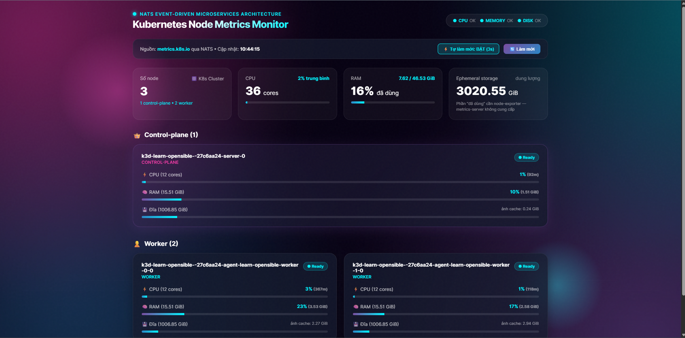

---

## 5. Why Endpoints Use Port `:4566`

LocalStack multiplexes emulated AWS services through a single gateway port `4566`, dispatching requests based on the HTTP `Host` header. Nothing is bound on port 80, so `:4566` is part of every URL, not a detail — and CloudFront's custom origin has to point at `httpPort: 4566` too.

---

## 6. LocalStack Limitations

### 6.1 Crossplane + LocalStack

| Symptom | Cause | Workaround |
| :--- | :--- | :--- |
| ProviderConfig accepted, but S3 calls go to `http://bucket.localstack:4566` | The CRD names its toggles in **snake_case** (`s3_use_path_style`, `skip_credentials_validation`, …). camelCase is pruned silently by the API server. | Use the exact CRD spelling. `bootstrap.sh` step 3 asserts four toggles survived and aborts if not. |
| Endpoint host rewritten per service (`s3.localstack`, `ecr.localstack`) | The AWS SDK derives per-service hostnames unless told otherwise | `spec.endpoint.hostnameImmutable: true` |
| `no matches for kind "ProviderConfig"` during bootstrap | The CRD ships inside the provider package and is not registered until it installs | Wait for `condition=Healthy` on the Provider, then for the CRD to be Established |
| ALB created with no subnets | `subnetIdRefs` does not exist on elbv2 `LB`. The AWS field is `subnets`, so the helper is `subnetRefs`. | Match the suffix to the AWS field name. `subnetIdRef` on `RouteTableAssociation` is correct because *its* field is `subnetId`. |
| CloudFront never created | `origin[].domainName` has no `*Ref`/`*Selector` — elbv2 `LB` is not wired as a reference target | the `localstack-wiring` CronJob patches the value; the appset lists the path under `ignoreDifferences` |
| CloudFront `Distribution` and Route53 `Zone`/`Record` rejected | `spec.forProvider.region` is **required**, even though both are global services | Set it. IAM is the one exception here — its CRDs have no `region` field at all, so adding one would be pruned. |
| `Route` stuck at `cannot resolve references` | `matchControllerRef: true` matches only resources composed by the same composite; these are standalone | Use a direct `gatewayIdRef`. |
| Composition rejected after a Crossplane upgrade | v2 removed native patch-and-transform (`spec.resources`) | Pinned to 1.16.0. The migration command is in `scripts/bootstrap.sh`. |

**The general shape of it.** Crossplane's structural CRDs turn a typo into a silent no-op where Terraform would have failed at `plan`. Every row above was a manifest that applied cleanly and did nothing. `kubectl get managed` and its SYNCED column are what make this tractable — see PROJECT_RULES §2.

### 6.2 ECR & EKS

| Symptom | Cause | Workaround |
| :--- | :--- | :--- |
| Registry host:port cannot be guessed | LocalStack allocates external ports from 4510–4559 | Query it: `aws ecr describe-repositories --query 'repositories[0].repositoryUri'` |
| `kubectl` TLS errors after `update-kubeconfig` | The reported endpoint is addressed for the Docker network and carries an untrusted CA | `kubectl config set-cluster --server=https://127.0.0.1:<port> --insecure-skip-tls-verify=true` **and unset** `certificate-authority-data` |
| `docker push` fails with `x509: certificate is valid for *.localhost.localstack.cloud` | The ECR host has four labels below the wildcard, and a TLS wildcard matches exactly one | Start the build daemon with `--insecure-registry <ecr-host>`. The k3d nodes get this from LocalStack automatically; a hand-started dind does not. |
| Node IP changes after cluster recreation | k3d reallocates container IPs | the `localstack-wiring` CronJob re-registers the target every two minutes |
| `Waiter ClusterActive failed ... matched expected path: "FAILED"`, plus `Timeout while waiting for EKS startup` in the LocalStack log | Reads like a slow machine; it is not. The default `K3S_IMAGE_TAG=1.36` resolves to a k3s that **dropped cgroup v1 support**, and the Docker Desktop WSL2 VM presents cgroup v1. The kubelet refuses to start and k3s exits ~3s in, so readiness polling times out at 150s. The k3d containers stay `Up` throughout, because the serverlb is a separate healthy nginx. | `K3S_IMAGE_TAG=v1.31.14-k3s1` in `docker-compose.yml` — the last line supporting cgroup v1. The real error is only visible in `docker logs k3d-<cluster>-server-0`. Host-wide alternative: give WSL2 cgroup v2 via `kernelCommandLine = cgroup_no_v1=all` in `%UserProfile%\.wslconfig`. |
| `helm --wait` ends in `Error: context deadline exceeded`, and pods sit `Pending` | LocalStack starts a **single-node** cluster and leaves `node-role.kubernetes.io/control-plane=true:NoSchedule` on the k3s server. Nothing calls `create-nodegroup`, so there is no untainted node. kube-system pods tolerate the taint and run, so the cluster looks healthy. The real message is only in `kubectl describe pod`: `1 node(s) had untolerated taint`. | `kubectl taint nodes --all node-role.kubernetes.io/control-plane-`, done by `bootstrap.sh` right after the nodes report Ready. The sibling lab avoided this by creating an EKS nodegroup, which gives untainted k3d agent containers. |
| `InvalidParameterException: The subnet ID subnet-mock-2 does not exist` on `create-cluster` | LocalStack validates subnet ids against its own EC2 service, so invented ids are rejected | discover them: the cluster goes in the account default VPC, because Crossplane runs *inside* this cluster and cannot provision the VPC that hosts it |
| `ImagePullBackOff` with `x509: certificate has expired` | LocalStack's cached certificate is valid ~90 days | Restart the container: `docker compose up -d localstack` |

### 6.3 ALB, CloudFront, Route53

| Symptom | Cause | Workaround |
| :--- | :--- | :--- |
| `http://<alb-dns>/` unreachable | Nothing is bound on port 80 | Append `:4566` |
| CloudFront returns blank responses | The origin defaults to port 80 | `customOriginConfig.httpPort: 4566` |
| CloudFront serves blank HTML in a browser while `curl` works | The proxy returns an uncompressed body with `Content-Encoding: gzip` | `compress: false` in [`next.config.js`](apps/web/next.config.js) |
| `www.learn-crossplane.internal` returns 200 with an empty body | **The gateway routes by its own static hostname patterns and never consults Route53 records** | Use the ALB or CloudFront domain directly |
| An Ingress host like `jenkins.localhost.localstack.cloud` never reaches the cluster | Same cause — the gateway has no knowledge of an Ingress inside k3d | A dedicated ALB per UI, `port-forward`, or a path rule on the host-less Ingress reached through the ALB |

### 6.4 CSRF Protection

- **Symptom:** Web application loads HTML without CSS or static JS assets (`403` for `/_next/static/*`).
- **Cause:** LocalStack's CSRF mitigation rejects requests whose `Origin`/`Referer` is not allowlisted: a browser sends none for the top-level document but one for every subresource, so the page renders unstyled and never hydrates.
- **Resolution:** Set `DISABLE_CORS_CHECKS=1` in [`docker-compose.yml`](docker-compose.yml). Local lab only — the check has no AWS counterpart, so disabling it changes nothing about the emulated services.

### 6.5 DNS Hijacking of Real CDNs

- **Symptom:** `ImagePullBackOff` on ingress-nginx — pulling from `registry.k8s.io` fails certificate verification for `cloudfront.net`.
- **Cause:** LocalStack is the DNS server for containers it creates, including the k3d nodes, and answers for domains it considers AWS-shaped. `registry.k8s.io` redirects image blobs to real CloudFront, LocalStack intercepts `*.cloudfront.net` with its own certificate, and containerd fails verification.
- **Resolution:** `DNS_NAME_PATTERNS_TO_RESOLVE_UPSTREAM` in `docker-compose.yml` forces those domains to real upstream DNS. It does **not** affect emulated CloudFront (`*.cloudfront.localhost.localstack.cloud`) or ECR.

This is also why every upstream manifest is vendored (PROJECT_RULES §7): a remote `kustomize` base on a host that is not in that allowlist fails at sync time, inside the ArgoCD repo-server, with an error that looks nothing like DNS.

---

## 7. Migrating to Real AWS

### 7.1 Required Changes

| # | Component | Migration Step |
| :-- | :--- | :--- |
| 1 | **ProviderConfig** | Delete the whole `spec.endpoint` block and the four `skip_*` toggles. Turn `s3_use_path_style` off. |
| 2 | **Credentials** | Replace the `aws-creds` Secret with IRSA: annotate the provider ServiceAccount with a role ARN and set `source: IRSA`. Delete `secret-credentials.yaml` from git. |
| 3 | **Compositions** | Migrate to Crossplane v2: `crossplane beta convert pipeline-composition`, install `function-patch-and-transform`, then unpin the chart in `scripts/bootstrap.sh`. |
| 4 | **CloudFront origin, Route53 alias, ALB listeners** | Replace the `localstack-wiring` CronJob with a Composition that hops the ALB `status.atProvider.dnsName` through the composite, then delete `gitops/platform/localstack-wiring/` and the two `ignoreDifferences` entries with it. Also set `customOriginConfig.httpPort: 80`.<br><br>**This item is larger than it looks, and it is the one to do first.** That CronJob also writes `crossplane.io/external-name` onto the four LBListeners, and without it Crossplane cannot find the listener it just created and makes another every 90 seconds. Deleting the CronJob deletes that fix while leaving its cause — two server-side-apply managers fighting over the atomic `defaultAction` array. On LocalStack that produced 855 listeners in silence. Real AWS behaves differently and more strictly: a second listener on a port already in use is refused with `DuplicateListener`, so the SECOND create fails, not the fifty-first, and no duplicates are ever made. The runaway is a LocalStack artefact — the CAUSE travels unchanged and becomes a resource that never goes Ready. The Composition is what actually fixes it, by leaving only ONE controller writing that field. |
| 5 | **Route53 alias zone id** | Use the ALB real canonical hosted zone id (us-east-1: `Z35SXDOTRQ7X7K`), and delegate the domain NS records. |
| 6 | **Cluster VPC** | The EKS cluster sits in the account default VPC because Crossplane cannot provision the VPC that hosts it. Create the cluster VPC in a separate bootstrap stack and pass its subnet ids to `create-cluster`. |
| 7 | **Security groups** | The rules in `networking/security-groups.yaml` become enforced. Narrow the `0.0.0.0/0` ingress and drop the blanket egress. |
| 8 | **ALB targets** | Switch `targetType` to `instance` and attach the target group to an Auto Scaling group. Then remove target registration from the `localstack-wiring` CronJob. |
| 9 | **Multi-AZ NAT** | Add NAT gateways per AZ with dedicated route tables. |
| 10 | **TLS** | Issue ACM certificates in `us-east-1` for CloudFront, add an HTTPS listener, redirect HTTP. |
| 11 | **ECR immutability** | `imageTagMutability: IMMUTABLE`. Tags are already commit SHAs, so nothing else changes. |
| 12 | **Jenkins registry auth** | Drop `--insecure-registry` from the dind step in the `Jenkinsfile`, keep the `aws ecr get-login-password` login, and add the AWS CLI to the build image so it is no longer conditional. |
| 13 | **Jenkins exposure** | `pollSCM` needs no inbound access. The moment Jenkins is reachable from outside: replace `loggedInUsersCanDoAnything` with real RBAC, put SSO in front of the local admin user, and add a webhook secret if you swap polling for a webhook. |
| 14 | **Privileged builds** | The `jenkins` namespace runs PodSecurity `privileged` so agents can run Docker-in-Docker as root. That is a container-escape surface, and it is the one item here that is a blocker rather than a chore. Move to a rootless builder (kaniko, buildkit rootless) or give agents their own cluster. |
| 15 | **JENKINS_HOME durability** | It sits on a `local-path` PVC — node-local, unbacked. Losing the node loses the credential store and every build record. Move to EBS with snapshots, or treat the controller as disposable and keep nothing but JCasC. |
| 16 | **GitHub token** | Revoke the development PAT; use a GitHub App or a dedicated CI secret. |

### 7.2 Cleanup and Optimization

| Item | Rationale |
| :--- | :--- |
| `DISABLE_CORS_CHECKS`, `DNS_NAME_PATTERNS_TO_RESOLVE_UPSTREAM` | Remove LocalStack-specific flags |
| `compress: false` | Re-enable compression and leverage CloudFront edge compression |
| Insecure TLS flags | Remove `--insecure-skip-tls-verify` from kubeconfig generation and restore the CA bundle |
| Plugin versions | Only the six top-level Jenkins plugins are pinned in `deployment.yaml`; their dependencies still float. Capture the full resolved set and list all of it. |

---

## 8. Secrets Management

Secrets management is structured so that **git never stores a real secret value**, while all infrastructure remains declaratively defined.

### 8.1 Secret Boundaries

| Secret | Storage Location | Purpose |
| :--- | :--- | :--- |
| `LOCALSTACK_PAT` | `.env` | Bootstrap token for LocalStack Pro container initialization |
| **GitHub PAT** (Ingestion) | `.env` (`GITHUB_TOKEN`) | Consumed exclusively by `make secrets` to populate Secrets Manager |
| **GitHub PAT** (Source) | **AWS Secrets Manager** (`learn-crossplane/github-token`) | Single source the cluster copies are built from |
| **GitHub PAT** (In-cluster) | k8s Secret `git-credentials` (ns `jenkins`) + ArgoCD repo credential `repo-learn-crossplane` (ns `argocd`) | Jenkins clones and pushes tags; ArgoCD reads the private repo |
| Jenkins admin password | k8s Secret `jenkins-secrets` | Generated once by `bootstrap.sh`, **never rotated on re-run**, read with `make verify` |
| Crossplane AWS credentials | `provider/secret-credentials.yaml` — **in git, on purpose** | `mock_access_key` / `mock_secret_key`: LocalStack accepts anything, and they are worthless anywhere else. On real AWS this becomes IRSA ([§13.3](#133-how-it-connects-to-aws-and-how-it-is-authorized)). |

### 8.2 Trust Chain Architecture

Secrets Manager is not readable from a Jenkins agent without AWS tooling and credentials in the pod, so the token is materialised into the cluster once, by `bootstrap.sh` step 5 — the only point in the lifecycle that already has both AWS access and `kubectl`. JCasC then registers it as the `github-token` credential (`x-access-token` + PAT) that the job uses to clone and push.

**This step is what connects CI to CD.** Without it the pipeline builds images, pushes them to ECR, reports success, and never updates the image tags. And without the ArgoCD repo credential the git generator cannot list `config.yaml` in a private repo, so the ApplicationSet silently creates zero Applications.

In production, IRSA would give both Jenkins and the Crossplane providers machine identity without static long-lived credentials; External Secrets Operator would replace the one-shot copy in `bootstrap.sh`.

### 8.3 Secret Flow

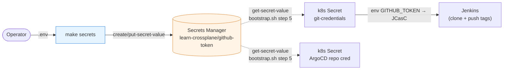

### 8.4 Secret Rotation

To rotate secrets:
```
Update .env → make secrets → kubectl -n jenkins rollout restart deployment/jenkins
```
`make secrets` refreshes the `git-credentials` Secret in the same run if the cluster is up; Jenkins reads it at boot, hence the restart. The ArgoCD repo credential is only rewritten by `make bootstrap`, which is idempotent and safe to re-run. `put-secret-value` creates a new secret version tagged `AWSCURRENT` while retaining the previous one as `AWSPREVIOUS` for instant rollback.

---

## 9. Observability: Logs, Traces, APM

Telemetry signals are collected centrally and exported to **SigNoz** via OpenTelemetry:

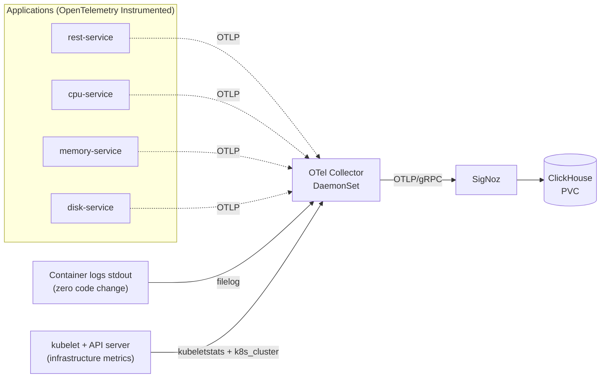

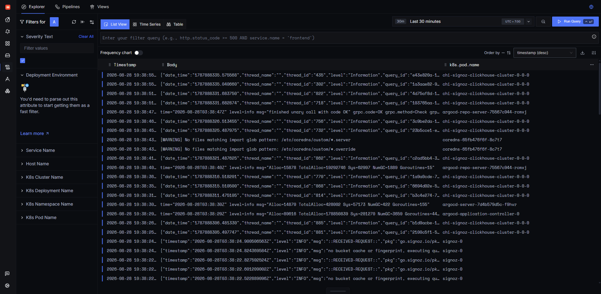

### 9.1 Decoupled Collector Architecture

Every pod ships to the OpenTelemetry Collector in the `observability` namespace, which fans out to SigNoz. Applications hold no backend configuration: endpoint, protocol and batching live in one `Instrumentation` CR ([`gitops/workloads/_shared/instrumentation.yaml`](gitops/workloads/_shared/instrumentation.yaml)), so swapping the backend (SigNoz, Tempo, Datadog) is one exporter change and no application redeploy.

### 9.2 Why SigNoz

Chosen over OpenObserve after running both in parallel on identical data. It wins on the built-in Kubernetes screens and on "Instrumentation checks", which names missing metrics outright rather than showing an empty panel. It is also by a wide margin the heaviest component in the cluster — the ClickHouse StatefulSet dominates startup time, which is why it sits at wave 22, before the Collector at 24, so the Collector logs are not full of connection refusals while ClickHouse comes up.

### 9.3 End-to-End Trace Propagation via Message Queue

Using **Redpanda (Kafka protocol)** enables automatic trace propagation across microservices without custom instrumentation code — the `traceparent` rides in the message header:

```
GET /api/k8s-metrics                    SERVER     rest-service     Go
├─ HTTP GET → cpu-service               CLIENT     rest-service
│  └─ GET /api/metrics                  SERVER     cpu-service      TypeScript
│     ├─ GET ×2                         CLIENT     → Kubernetes API
│     └─ send node-metrics              PRODUCER   cpu-service      ← Enters Queue
│        ├─ redpanda transit            INTERNAL   history-service  ← Synthetic Span
│        └─ node-metrics receive        CONSUMER   history-service  Python
├─ HTTP GET → memory-service            CLIENT
│  └─ …                                            memory-service   Python
└─ HTTP GET → disk-service              CLIENT
   └─ …                                            disk-service     Java
```

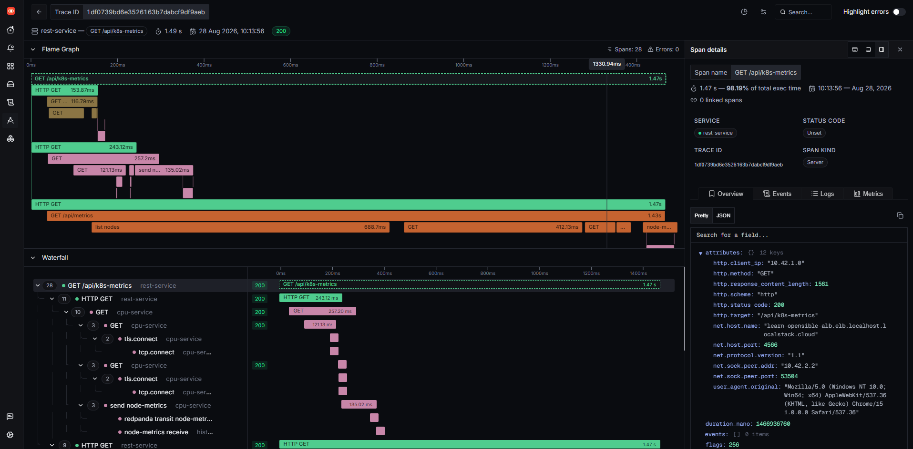

### 9.4 Synthetic Transit Spans

`history-service` is the only service with OpenTelemetry code: `record_queue_transit()` calculates message queue transit time from the producer timestamp, something auto-instrumentation cannot do:

```python
ctx = propagate.extract({k: v.decode() for k, v in msg.headers})
span = _tracer.start_span("redpanda transit " + msg.topic, context=ctx,
                          start_time=msg.timestamp * 1_000_000)
span.end()
```

### 9.5 Multi-Language Implementation Summary

| Service | Language | Base Image |
| :--- | :--- | :--- |
| rest-service | **Go** | distroless static |
| history-service | **Python** | python:3.12-slim |
| cpu-service | **TypeScript** | node:20-alpine |
| memory-service | **Python** | python:3.12-slim |
| disk-service | **Java** | temurin:21-jre-alpine |

Disk metrics are gathered directly from the kubelet `/stats/summary` endpoint over authenticated TLS using the cluster CA and bounded ServiceAccount tokens, avoiding privileged `nodes/proxy` RBAC assignments.

### 9.6 OpenTelemetry Operator Auto-Instrumentation

A single pod annotation replaces the agent that used to be baked into each image:

```yaml
template:
  metadata:
    annotations:
      instrumentation.opentelemetry.io/inject-nodejs: "true"
      instrumentation.opentelemetry.io/inject-python: "true"
      instrumentation.opentelemetry.io/inject-java: "true"
```

The operator adds an init container, mounts the language agent, and sets the `OTEL_*` variables from the `Instrumentation` CR. The image knows nothing about OpenTelemetry. Go is the exception, since it has no runtime agent, so `rest-service` is instrumented in code.

The ordering constraint is easy to miss: a pod that starts *before* the `Instrumentation` CR exists comes up healthy and completely untraced, with no error anywhere. Hence `_shared` at wave 30 and the services at 35.

Health check spans (`/health`, `/ready`, `/healthz`, `/metrics`) are filtered at the Collector layer to prevent trace spam.

### 9.7 Accessing Observability UI

SigNoz is exposed through a dedicated ALB:

```
http://learn-crossplane-signoz-alb.elb.localhost.localstack.cloud:4566/
```

| NodePort | Service | ALB Endpoint |
| ---: | :--- | :--- |
| 30080 | ingress-nginx | Web application |
| 30081 | argocd-server | ArgoCD UI |
| 30082 | jenkins | Jenkins UI |
| 30083 | signoz | SigNoz UI |

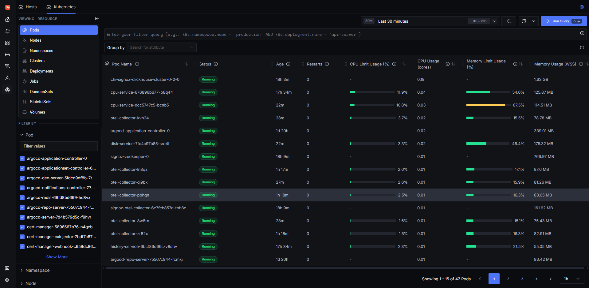

---

## 10. Useful Commands

```bash
# Overall state, top to bottom
make status
make verify

# Every AWS resource Crossplane owns — SYNCED/READY explained in §13.7
kubectl get managed
kubectl get providers.pkg.crossplane.io

# What localstack-wiring did on its last pass (entry URLs included)
kubectl -n localstack-wiring logs -l app=localstack-wiring --tail=20

# ArgoCD Applications
kubectl -n argocd get applications

# Trigger the Jenkins job without waiting for the poll
make run-ci

# Why did a push produce no build?
kubectl -n jenkins exec deploy/jenkins -- \
  cat /var/jenkins_home/jobs/monorepo-ci/scm-polling.log

# LocalStack logs
docker compose logs -f localstack

# Teardown local environment
make destroy
make purge
```

See [`PROJECT_RULES.md`](PROJECT_RULES.md) for data directory rules and the CRD-pruning traps.

---

## 11. Change Execution Order

| Modified Component | Required Action |
| :--- | :--- |
| `gitops/infrastructure/**` | `git push` → ArgoCD syncs, Crossplane reconciles into LocalStack |
| `gitops/platform/**`, `gitops/workloads/**` | `git push` → ArgoCD detects and syncs automatically |
| `apps/**` | `git push` → Jenkins picks it up within 2 min (or `make run-ci`) → ArgoCD deploys new tags |
| `Jenkinsfile` | `git push` → used by the next build |
| `gitops/platform/jenkins/casc/jenkins.yaml` | `git push` → ArgoCD syncs; JCasC re-applies on controller restart |
| **OpenTelemetry Config** (`instrumentation.yaml`) | `git push` → Restart pods (no image rebuilds required) |
| `gitops/bootstrap/**`, `scripts/bootstrap.sh` | `git push` → `make bootstrap` |
| `docker-compose.yml` | `docker compose up -d localstack` |
| **GitHub Token Rotation** | `make secrets` → restart Jenkins → `make bootstrap` to refresh the ArgoCD repo credential |

---

## 12. Why Jenkins, and what the two detours through CodeBuild and Tekton taught

This lab has now run its CI on three engines, and the reason for each change was different from the reason expected going in.

**CodeBuild → Tekton.** The stated reason was triggering: LocalStack's CodeBuild cannot start a build from a git push without mocking SNS and Lambda, so `learn-opensible` always kicked builds off by hand. Tekton was chosen because it ships a complete trigger stack.

That reasoning was half right, and the half that was wrong took nineteen hours of uptime to surface. The `EventListener` was healthy the entire time and had never received a single event, because it is a ClusterIP inside a k3d cluster on a laptop:

```
GitHub → home IP → NAT router → Windows → WSL2 → Docker Desktop → k3d → 10.43.x
```

Nothing on that path forwards inbound. **The blocker was never the CI tool.** CodeBuild would sit behind exactly the same NAT. Swapping engines could not fix a reachability problem one layer below the engine, and the eventual fix was to invert the direction — poll from inside the cluster, which only ever makes outbound calls. ArgoCD in this same cluster had been doing precisely that all along.

**Tekton → Jenkins.** The question was whether Jenkins can be configured entirely from git, without touching its dashboard. It can, and it reaches further than Tekton does: Tekton lets you declare pipelines in YAML but has no controller state to declare, while Jenkins has a great deal of it and JCasC declares all of it.

| | CodeBuild on LocalStack | Tekton | Jenkins |
| :--- | :--- | :--- | :--- |
| **Pipeline definition** | `buildspec.yml` | `Pipeline` + `Task` CRDs | `Jenkinsfile` |
| **Controller config** | n/a (managed) | nothing to configure | `casc/jenkins.yaml` (JCasC) |
| **Job definition** | console or IaC | a `PipelineRun` object | Job DSL, inside the JCasC file |
| **Build concurrency** | account limits | no `maxConcurrency`; smuggled in as a memory request | `containerCapStr`, stated directly |
| **Trigger from git** | needs SNS/Lambda mocking | `EventListener` — unreachable behind NAT | `pollSCM`, built in |
| **Agents** | LocalStack container wrapper | Pods | Pods |
| **Mutable state** | none | none | `JENKINS_HOME`, and this is the real cost |

**The two things Jenkins does better here** are both consequences of it being older and having met these problems already. `containerCapStr: "2"` says what the build concurrency limit is; Tekton has no such knob, so the same limit had to be expressed as a memory request — which was sized against the wrong resource and cost an entire pipeline to TLS handshake timeouts before the mistake was visible ([§3.5](#35-jenkinsfile--ci-pipeline)). And `pollSCM` is one line, where Tekton needed a hand-written CronJob to feed its own EventListener from inside the cluster.

**The one thing it does worse** is not fixable by configuration. Tekton kept nothing: a `PipelineRun` was a disposable object and every definition was a manifest. Jenkins writes job definitions, build history, plugin state and its credential store to `JENKINS_HOME`, and anything changed through the UI is persisted there and silently diverges from git until the next reload. JCasC reasserts the configuration on every boot, which narrows the window but does not close it. That is the honest price of this migration, and no amount of YAML removes it.

---

## 13. Crossplane, from the ground up

Written for someone who has used Terraform but not Crossplane. If you only read one part, read [§13.3](#133-how-it-connects-to-aws-and-how-it-is-authorized) — the authorization model is where the two tools differ most, and where the confusion is most expensive.

### 13.1 Which AWS service is configured in which file

Everything under `gitops/infrastructure/` (except `provider/` and `compositions/`) is a **managed resource**: a Kubernetes object that stands for one AWS resource. 48 of them across 14 files.

| File | AWS service | Objects it creates |
| :--- | :--- | :--- |
| `networking/vpc.yaml` | EC2 / VPC | `VPC` — 10.0.0.0/16, DNS hostnames on |
| `networking/subnets.yaml` | EC2 / VPC | `Subnet` ×4 — private a/b, public a/b, across two AZs |
| `networking/internet-gateway.yaml` | EC2 / VPC | `InternetGateway` |
| `networking/route-tables.yaml` | EC2 / VPC | `RouteTable`, `Route` (0.0.0.0/0 → IGW), `RouteTableAssociation` ×2 |
| `networking/security-groups.yaml` | EC2 / VPC | `SecurityGroup` + `SecurityGroupRule` ×2 (ingress :80, egress all) |
| `storage/s3-cicd-artifacts.yaml` | S3 | `Bucket` + `BucketPublicAccessBlock` + `BucketServerSideEncryptionConfiguration` + `BucketVersioning` + `BucketLifecycleConfiguration` |
| `registry/ecr-repositories.yaml` | ECR | `Repository` ×6 (one per service) + `LifecyclePolicy` ×6 |
| `loadbalancer/alb-web.yaml` | ELBv2 | `LB` + `LBTargetGroup` (:30080, health `/healthz`) + `LBListener` — the application load balancer |
| `loadbalancer/alb-argocd.yaml` | ELBv2 | `LB` + `LBTargetGroup` (:30081) + `LBListener` |
| `loadbalancer/alb-jenkins.yaml` | ELBv2 | `LB` + `LBTargetGroup` (:30082, health `/login`) + `LBListener` |
| `loadbalancer/alb-signoz.yaml` | ELBv2 | `LB` + `LBTargetGroup` (:30083) + `LBListener` |
| `cdn-dns/cloudfront.yaml` | CloudFront | `Distribution` — origin is the app ALB |
| `cdn-dns/route53.yaml` | Route53 | `Zone` + `Record` (alias → app ALB) |
| `iam/roles.yaml` | IAM | `Role` + `Policy` + `RolePolicyAttachment` |
| `provider/provider-aws.yaml` | — | `Provider` ×8 — the controllers, not AWS resources |
| `provider/secret-credentials.yaml` | — | `Secret` — the AWS credentials |
| `provider/provider-config.yaml` | — | `ProviderConfig` — endpoint + which credentials to use |
| `compositions/` | — | The abstraction layer. [§13.5](#135-what-iac-compositions-is) |

Note the last four rows: they are **not** AWS resources. They are the machinery that lets the other rows become AWS resources.

**A trap worth naming now:** `iam/roles.yaml` creates an IAM Role, and that Role is *not* how Crossplane authenticates to AWS. It is a resource Crossplane **creates**, for the application workloads to use later. What Crossplane itself authenticates with is in [§13.3](#133-how-it-connects-to-aws-and-how-it-is-authorized). The two are unrelated and it is easy to assume otherwise.

### 13.2 How a YAML file becomes an AWS resource

Terraform runs as a CLI, reads state, makes a plan, applies it, exits. Crossplane runs as **controllers that never exit**. The chain for a single resource:

```
gitops/infrastructure/storage/s3-cicd-artifacts.yaml
  │   kind: Bucket, apiVersion: s3.aws.upbound.io/v1beta1
  ▼
ArgoCD applies it to the cluster
  │
  ▼
The CRD "buckets.s3.aws.upbound.io" accepts it
  │   That CRD was installed by the provider-aws-s3 PACKAGE, not by this repo.
  ▼
The provider-aws-s3 CONTROLLER (a Deployment in crossplane-system) sees a new Bucket
  │
  ├─ reads spec.providerConfigRef  → defaults to the ProviderConfig named "default"
  │
  ├─ ProviderConfig tells it TWO things:
  │     credentials → read the Secret aws-creds in crossplane-system
  │     endpoint    → talk to http://localstack:4566 instead of real AWS
  │
  ▼
Calls the AWS API (the Upbound providers wrap the Terraform AWS provider internally)
  │
  ▼
Writes back onto the SAME object:
     status.atProvider     what AWS actually reports
     status.conditions     Synced=True (request accepted), Ready=True (resource exists)
     metadata.annotations  crossplane.io/external-name = the real AWS name
```

Then it does it again, every few minutes, forever. That loop is the whole point: if someone deletes the bucket in the AWS console, the controller notices on the next pass and recreates it. Terraform would only notice at the next `plan`.

**Where each piece lives:**

| Piece | Where |
| :--- | :--- |
| The Crossplane engine | `crossplane` Deployment, namespace `crossplane-system`, installed by `scripts/bootstrap.sh` via Helm, pinned to 1.16.0 |
| The 8 provider controllers | `provider-aws-*` Deployments in `crossplane-system` — one per AWS service family |
| The CRDs | Installed by the provider packages. `kubectl get crds \| grep upbound` lists ~1000 |
| Your desired state | `gitops/infrastructure/`, applied by ArgoCD |
| The observed state | `status.atProvider` on each object |

### 13.3 How it connects to AWS, and how it is authorized

There are **two completely separate permission systems**, and mixing them up is the most common Crossplane misunderstanding.

**Plane 1 — Kubernetes RBAC: what the controller may do inside the cluster.**

Each provider runs under its own ServiceAccount, and Crossplane generates the RBAC for it:

```
Deployment  provider-aws-s3-d17766e0e571
  serviceAccountName: provider-aws-s3-d17766e0e571
       ▲
       │ bound by
ClusterRoleBinding  crossplane:provider:provider-aws-s3-d17766e0e571:system
       │ to
ClusterRole         crossplane:provider:provider-aws-s3-d17766e0e571:system
                      - watch/update Buckets and the other s3 CRDs
                      - read Secrets (this is how it reaches aws-creds)
                      - write Events
```

You do not write this RBAC. Crossplane's RBAC manager creates it when the `Provider` is installed, which is why `provider/provider-aws.yaml` is only eight short blocks. Inspect it with:

```bash
kubectl get clusterrole | grep crossplane:provider
```

This plane governs the cluster only. It grants nothing in AWS.

**Plane 2 — AWS credentials: what the controller may do in AWS.**

```yaml
# gitops/infrastructure/provider/secret-credentials.yaml
kind: Secret
metadata: { name: aws-creds, namespace: crossplane-system }
stringData:
  credentials: |
    [default]
    aws_access_key_id = mock_access_key
    aws_secret_access_key = mock_secret_key
```

```yaml
# gitops/infrastructure/provider/provider-config.yaml
kind: ProviderConfig
metadata: { name: default }        # ← managed resources reference this name by default
spec:
  credentials:
    source: Secret                 # ← read them from a Secret
    secretRef: { namespace: crossplane-system, name: aws-creds, key: credentials }
  endpoint:
    url: { type: Static, static: http://localstack:4566 }
    hostnameImmutable: true
```

That is the entire link between Kubernetes and AWS. Two objects.

The credentials are deliberately fake. LocalStack accepts any credential and never checks a signature, so these grant everything and are worth nothing outside this laptop — which is why the Secret is committed to git. **On real AWS none of this survives:** delete the Secret, delete the whole `spec.endpoint` block, and switch to IRSA, where the provider's ServiceAccount is annotated with a role ARN and AWS itself issues short-lived credentials. [§7](#7-migrating-to-real-aws) lists the full migration.

**Why `http://localstack:4566` and not `localhost`.** The controllers are pods inside the cluster. `localhost` there is the pod itself. `localstack` is the Docker Compose service name, resolvable on the shared network. The host uses `http://localhost:4566` — same service, different vantage point.

**Why `hostnameImmutable: true` matters.** Without it the AWS SDK rewrites the endpoint host per service — `bucket-name.localstack:4566` for S3, `ecr.localstack` for ECR — because that is how real AWS addresses those services. LocalStack serves everything on one host, so the rewrite has to be turned off.

**The snake_case trap.** The four `skip_*` toggles and `s3_use_path_style` in that file are snake_case because the CRD declares them that way. In camelCase the API server **prunes them silently** — the object is accepted, the fields vanish, and S3 fails much later for reasons that point nowhere near here. `scripts/bootstrap.sh` asserts all four survived, and the `localstack-wiring` CronJob re-checks on every loop. [§6.1](#61-crossplane--localstack).

### 13.4 References: how one resource points at another

Terraform writes `vpc_id = aws_vpc.main.id`. Crossplane has no expression language, so it uses one of three forms:

```yaml
vpcId: vpc-0a3ac35                  # the literal value, if you know it
vpcIdRef:      { name: learn-crossplane-vpc }        # by Kubernetes object name
vpcIdSelector: { matchLabels: { environment: dev } } # by label
```

A `Ref` or `Selector` is an **input**. Crossplane resolves it and then writes the resolved value back into `spec.forProvider` alongside it. That is worth knowing for two reasons.

**It creates permanent ArgoCD drift.** Git has only the selector; the live object also has the `*Ref` and the concrete ARN, so the two never match. `LBListener` was stuck OutOfSync for exactly this. The appset now excludes those four field paths — and only for that kind, because ServerSideDiff reconciles top-level resolved fields on its own and only fails on values nested inside an array (`defaultAction[].targetGroupArn`).

**The suffix follows the AWS field, not a convention.** `subnets` (a list) gives `subnetRefs`; `subnetId` (a scalar) gives `subnetIdRef`. Guessing `subnetIdRefs` on an elbv2 `LB` produces a field the API server prunes without a word, and the load balancer then fails to create for want of subnets. Check before you guess:

```bash
kubectl explain lb.elbv2.aws.upbound.io.spec.forProvider --recursive | grep -i subnet
```

And `matchControllerRef: true` inside a selector means "only match resources composed by the same composite". Standalone resources have no controller reference, so it matches nothing and the resource sits at `cannot resolve references` forever.

### 13.5 What `iac-compositions` is

This is the part that makes Crossplane more than YAML-flavoured Terraform, and the reason the project has it at all. Three objects, in `gitops/infrastructure/compositions/`:

| File | Object | In one line |
| :--- | :--- | :--- |
| `xrd-app-infra.yaml` | `CompositeResourceDefinition` | Defines a **new API of your own**: "an `AppInfra` has an `environment`" |
| `composition-aws.yaml` | `Composition` | The implementation: an `AppInfra` means one S3 bucket plus one ECR repository |
| `claim-example.yaml` | `AppInfra` | A request: "give me an AppInfra for dev" |

Applying the XRD makes Crossplane generate a real CRD, so `AppInfra` becomes a kind your cluster understands. A developer then writes five lines:

```yaml
apiVersion: devops.platform.io/v1alpha1
kind: AppInfra
metadata: { name: sample-microservice-infra }
spec:
  compositionRef: { name: app-infra-aws }
  environment: dev
```

and gets, without knowing that S3 or ECR exist:

```
sample-microservice-infra
  └─ XAppInfra/sample-microservice-infra-f5ztv
       ├─ Bucket/sample-microservice-infra-f5ztv-bucket        → real S3 bucket
       └─ Repository/sample-microservice-infra-f5ztv-repo      → real ECR repository
```

That is the "platform as a product" idea: the platform team owns the Composition and can change *how* infrastructure is built — add encryption, change naming, swap clouds — without any application team editing anything. Terraform modules get close, but the consumer still runs Terraform and holds cloud credentials. Here the consumer only submits a Kubernetes object and never touches AWS.

**Why it was broken, and what that teaches.** The Application showed `Healthy` with all three resources `Missing`, and `one or more synchronization tasks are not valid`. ArgoCD dry-runs every manifest before applying any of them; on a fresh cluster the `AppInfra` CRD does not exist yet, the dry-run of the claim failed, and the entire sync was rejected — including the XRD that would have created that CRD. A deadlock reporting itself as healthy. Fixed with sync-wave 0/1/2 (waves *within* one Application are honoured, unlike waves between ApplicationSet-generated Applications) plus `SkipDryRunOnMissingResource` on the claim.

`compositionRef` is required, incidentally. Having exactly one matching Composition is not enough — selection is explicit by design, so adding a second Composition later cannot silently re-point existing claims.

### 13.6 What `localstack-wiring` is

A CronJob in `gitops/platform/localstack-wiring/`, every two minutes. It exists because three pieces of state **cannot be written down as a manifest** — their values are assigned at creation time:

| What | Why it cannot be declared |
| :--- | :--- |
| ALB target group membership | k3d gives the node a new container IP on every cluster recreation |
| CloudFront origin `domainName` | Needs the ALB's DNS name, and cloudfront has no `*Ref` pointing at elbv2 |
| Route53 `alias.name` and `zoneId` | Same, plus the ALB's canonical hosted zone id |

In the OpenTofu sibling lab these are ordinary interpolations — `aws_lb.main.dns_name`. Crossplane has no equivalent between two standalone managed resources, and this is the one place where it is strictly weaker.

All three used to be one-shot host scripts you had to remember to re-run. As a CronJob they are declared in git, versioned with everything else, and self-healing: it no longer matters whether the ALB existed when the manifest first synced, or whether the node IP changed an hour ago. Every write is compared first, so a converged cluster only logs.

Git holds documented placeholders for the two patched fields, and the appset lists those paths under `ignoreDifferences` so selfHeal does not overwrite the patch every reconcile.

It also re-asserts the ProviderConfig snake_case toggles on every loop, because that failure is silent everywhere else, and pins `crossplane.io/external-name` on the LBListeners ([§7.1](#71-required-changes) item 4).

Read what it last did:

```bash
kubectl -n localstack-wiring logs -l app=localstack-wiring --tail=20
```

The fully declarative alternative, if you want to take it further: pull the LB, Distribution and Record into one Composition and hop the value through the composite with `ToCompositeFieldPath` → `FromCompositeFieldPath`. That is the idiomatic Crossplane answer to "resource B needs a runtime value from resource A", and it is what would let you delete this CronJob.

### 13.7 Reading the state

```bash
kubectl get managed          # every AWS resource Crossplane owns, in one table
```

The two status columns mean different things, and the distinction saves the most time:

| SYNCED | READY | Meaning |
| :--- | :--- | :--- |
| `False` | — | **The request never reached AWS.** A selector matched nothing, a referenced object is absent, or a field was pruned by the API server. Look at the manifest. |
| `True` | `False` | AWS received it and rejected it, or it is still being created. Look at the provider's error. |
| `True` | `True` | Reconciled. |

```bash
kubectl describe bucket.s3.aws.upbound.io learn-crossplane-cicd-artifacts   # Events carry the provider error
kubectl get providers.pkg.crossplane.io                                     # are the controllers even running
kubectl -n crossplane-system logs deploy/provider-aws-s3-<hash> --tail=50
```

`make verify` wraps the parts you look at most.

### 13.8 What `iac-cdn-dns` is, and why half of it is decorative

Two files, three objects, and the most instructive Application in the repo — because it is where LocalStack stops behaving like AWS.

| Object | File | What it is for |
| :--- | :--- | :--- |
| `Distribution` | `cdn-dns/cloudfront.yaml` | A CloudFront CDN whose **origin is the application ALB** |
| `Zone` | `cdn-dns/route53.yaml` | The hosted zone `learn-crossplane.internal` |
| `Record` | `cdn-dns/route53.yaml` | `www.learn-crossplane.internal` → A alias → the ALB |

Live state:

```
distribution/learn-crossplane-cf     True True   39aeda73
zone/learn-crossplane-zone           True True   UFT67MCE3WXY1OUMYZUKP4
record/learn-crossplane-record       True True   ..._www.learn-crossplane.internal_A

cf origin      learn-crossplane-alb.elb.localhost.localstack.cloud
cf httpPort    4566
cf domain      39aeda73.cloudfront.localhost.localstack.cloud
r53 alias      learn-crossplane-alb.elb.localhost.localstack.cloud
```

**CloudFront works.** `http://39aeda73.cloudfront.localhost.localstack.cloud:4566/` really does serve the app through the distribution, which then fetches from the ALB.

**Route53 does not.** The Zone and the Record both exist and both report Ready, and `www.learn-crossplane.internal` still resolves nowhere. LocalStack's gateway routes by matching the Host header against **its own static hostname patterns**; it never consults the Route53 records it is storing. So the record is real data in a real API that nothing queries — [§6.3](#63-alb-cloudfront-route53). It is worth keeping precisely because it is what you would write for real AWS, and because migrating means changing the record, not adding one.

Three details in these two files that are LocalStack-specific and would be wrong on AWS:

- **`customOriginConfig.httpPort: 4566`.** LocalStack binds nothing on port 80 and multiplexes every emulated endpoint behind its gateway port. Real CloudFront would use 80, and this is item 4 in the [§7.1](#71-required-changes) migration list.
- **`origin[].domainName` and `alias.name` are placeholders in git.** Neither can be known at commit time, and cloudfront/route53 have no `*Ref` pointing at elbv2, so the `localstack-wiring` CronJob patches both from the ALB status. [§13.6](#136-what-localstack-wiring-is).
- **The alias `zoneId` is whatever LocalStack invents** — `Z2P70J7EXAMPLE` here, read from the LB's own `status.atProvider.zoneId`. On real AWS this is the load balancer's canonical hosted zone id, a fixed per-region constant (`Z35SXDOTRQ7X7K` in us-east-1), and getting it wrong produces an alias record that silently points at nothing.

Both patched fields are listed under `ignoreDifferences` in the appset, or selfHeal would overwrite the CronJob's work with the git placeholders every reconcile.
