# learn-crossplane — AWS + Crossplane DevOps Platform on LocalStack

An end-to-end Kubernetes-native DevOps platform **running entirely on a local machine**:

- **Infrastructure as Code** — declared as Kubernetes custom resources with **Crossplane**, continuously reconciled.
- **Continuous Integration** — Kubernetes-native pipelines, triggers and dashboard with **Tekton**.
- **Continuous Delivery** — pull-based GitOps with **ArgoCD**, one ApplicationSet.
- **Microservices** — six services on EKS, served via ALB → CloudFront.
- **Observability** — **OpenTelemetry Operator + Collector + SigNoz** for traces, logs and metrics.
- **Zero cloud cost** — every AWS service emulated by **LocalStack Pro**.

This is the second lab in a pair. The first, `learn-opensible`, builds the same platform with
OpenTofu + Ansible + AWS CodeBuild. Where the two differ this README says so — those
differences are the point of the exercise, and §6.1 is the honest list of places where
Crossplane made things *harder* than Terraform did.

---

## 0. Architecture Overview

```mermaid
flowchart TD
    subgraph Host["Developer Machine"]
        ENV[".env (GITHUB_TOKEN, LOCALSTACK_PAT)"]
        SCRIPTS["scripts/*.sh · Makefile"]
    end

    subgraph LS["LocalStack Pro Gateway (:4566)"]
        LSEKS["LocalStack EKS (k3d cluster)"]
        AWS_S3["S3 (CI/CD artifacts)"]
        AWS_ECR["ECR (6 repositories)"]
        AWS_NET["VPC · Subnets · IGW · RouteTables · SG"]
        AWS_ALB["ALB + TargetGroup (:30080)"]
        AWS_CF["CloudFront distribution"]
        AWS_R53["Route53 (learn-crossplane.internal)"]
        AWS_SM["Secrets Manager (GitHub PAT)"]
    end

    subgraph K8S["EKS Cluster"]
        subgraph CP["crossplane-system"]
            CP_CORE["Crossplane 1.16.0"]
            UP_AWS["Upbound AWS providers<br/>s3 · ecr · ec2 · elbv2 · iam · cloudfront · route53"]
            PC["ProviderConfig to http://localstack:4566"]
        end

        subgraph TEKTON["tekton-pipelines + tekton-ci"]
            TEK_PIPE["Pipeline: git-clone, build+push, git-update"]
            TEK_TRIG["EventListener + github/CEL interceptors"]
            TEK_DASH["Dashboard (:9097)"]
            TEK_SEC["Secret: git-credentials"]
        end

        subgraph ARGO["argocd"]
            APPSET["One ApplicationSet"]
        end

        subgraph PLAT["Platform"]
            NGX["ingress-nginx (:30080)"]
            CERT["cert-manager"]
            PANDA["redpanda (Kafka)"]
            OTEL["otel-operator + collector"]
            SIG["signoz"]
        end

        subgraph APPS["devops-apps"]
            WEB["web (:3000)"]
            REST["rest-service (:4000)"]
            METRICS["cpu :4001 · memory :4002<br/>disk :4003 · history :4004"]
        end
    end

    ENV -->|"00 ingest secret"| AWS_SM
    SCRIPTS -->|"01 bootstrap cluster"| LSEKS
    SCRIPTS -->|"02 install engine, wait Healthy"| CP
    AWS_SM -->|"03 materialise token"| TEK_SEC
    SCRIPTS -->|"03 bootstrap GitOps"| ARGO
    AWS_ALB -->|"04 patch runtime DNS name"| AWS_CF
    AWS_ALB -->|"04 patch alias record"| AWS_R53

    APPSET -->|"sync infrastructure CRs"| CP
    UP_AWS -->|"reconcile, correct drift"| LS
    APPSET -->|"sync Tekton"| TEKTON
    APPSET -->|"sync platform"| PLAT
    APPSET -->|"sync workloads"| APPS

    TEK_PIPE -->|"build, push images"| AWS_ECR
    TEK_PIPE -->|"commit new image tags"| APPSET

    AWS_ALB -->|"NodePort :30080"| NGX
    NGX --> WEB
    NGX --> REST
```



Four flows, in order:

1. **Bootstrap** — steps 00 to 04 are imperative on purpose. §3.3 explains which parts cannot be GitOps, and why.
2. **IaC** — ArgoCD syncs `gitops/infrastructure/`; Crossplane reconciles it into LocalStack and corrects drift.
3. **CI/CD** — a commit runs the Tekton pipeline, which pushes images to ECR and then **writes the new tags back to git**; ArgoCD deploys them.
4. **Request** — browser → CloudFront → ALB → ingress-nginx → web / rest-service → the four metric services → Redpanda.

---

## 1. Why Tekton instead of CodeBuild

The trigger is the reason. LocalStack's CodeBuild cannot start a build from a git push
without mocking SNS and Lambda, so `learn-opensible` always kicked builds off by hand.

| | AWS CodeBuild on LocalStack | Tekton |
| :--- | :--- | :--- |
| **Execution** | LocalStack's own container wrapper | native Pods and CRDs (`Task`, `Pipeline`, `PipelineRun`) |
| **Trigger** | needs SNS/Lambda mocking | `EventListener` + `TriggerBinding` + interceptors, built in |
| **Definition** | `buildspec.yml` | declarative Kubernetes YAML, managed by GitOps like everything else |
| **UI** | LocalStack container logs | Dashboard with per-step logs and a pipeline graph |
| **Portability** | AWS only | any Kubernetes cluster |

**What this lab does and does not deliver on that promise.** The trigger machinery is real
and wired: interceptors filter the event, a `TriggerTemplate` creates the `PipelineRun`. But
an `EventListener` on a laptop is not reachable from GitHub, and nothing here registers a
webhook on the GitHub side. So the trigger is **still manual today**: `make run-ci` starts a
run. §8.2 covers the three ways to make it genuinely automatic, the loop prevention that
becomes mandatory the moment you do, and the curl that exercises the interceptor chain.

---

## 2. Repository Structure

```
learn-crossplane/
├── apps/                                Source and Dockerfiles (6 microservices)
│   ├── web/                             Next.js 14 frontend        node:20-alpine    :3000
│   ├── rest-service/                    Go API gateway             distroless        :4000
│   ├── cpu-service/                     TypeScript / Node          node:20-alpine    :4001
│   ├── memory-service/                  Python                     python:3.12-slim  :4002
│   ├── disk-service/                    Java / Maven               temurin:21-jre    :4003
│   └── history-service/                 Python Kafka consumer      python:3.12-slim  :4004
├── gitops/                              GitOps single source of truth
│   ├── bootstrap/                       Applied once, by hand
│   │   ├── argocd/                      ArgoCD v2.13.2
│   │   └── appset.yaml                  the one ApplicationSet, discovers every config.yaml
│   ├── infrastructure/                  Crossplane managed resources
│   │   ├── provider/                    wave 1   Upbound providers, credentials, ProviderConfig
│   │   ├── iam/                         wave 1   platform role and policy
│   │   ├── compositions/                wave 1   XRD, Composition, example claim
│   │   ├── networking/                  wave 2   VPC, subnets, IGW, route tables, SG + rules
│   │   ├── storage/                     wave 2   S3 artifacts bucket (versioning, SSE, lifecycle)
│   │   ├── registry/                    wave 2   6 ECR repositories + lifecycle policies
│   │   ├── loadbalancer/                wave 2   ALB, TargetGroup (:30080), HTTP listener
│   │   └── cdn-dns/                     wave 3   CloudFront, Route53 zone and record
│   ├── platform/
│   │   ├── ingress-nginx/               wave 0   NodePort 30080
│   │   ├── cert-manager/                wave 5   issues the OTel operator webhook cert
│   │   ├── localstack-wiring/           wave 4   CronJob: ALB target + CF/Route53 wiring
│   │   ├── tekton/                      wave 8   Pipelines, Triggers, Dashboard (all vendored)
│   │   ├── redpanda/                    wave 12  Kafka-compatible queue
│   │   ├── otel-operator/               wave 15  injects auto-instrumentation agents
│   │   ├── signoz/                      wave 22  observability backend
│   │   └── otel-collector/              wave 24  cluster telemetry pipeline
│   └── workloads/
│       ├── _shared/                     wave 30  Namespace, Ingress, Instrumentation
│       └── <service>/                   wave 35  Deployment, Service, Kustomization
├── scripts/                             Four files. See §3.3 for why not fewer, and not more
│   ├── lib.sh                           Sourced by all: loads .env, anchors cwd, aws_() helper
│   ├── secrets.sh                       GITHUB_TOKEN into AWS Secrets Manager
│   ├── bootstrap.sh                     Cluster, Crossplane, providers, ArgoCD, ApplicationSet
│   └── destroy.sh                       Teardown (--purge-data for a clean slate)
├── docker-compose.yml                   LocalStack Pro
├── Makefile                             One-command lifecycle
└── PROJECT_RULES.md                     Safety rules and the CRD-pruning traps
```

**New to Crossplane?** §11 explains which AWS service each file under `gitops/infrastructure/`
configures, how a YAML file becomes an AWS resource, and how the whole thing is authorized.

Adding a component is: create a directory and a five-field `config.yaml`
(`name`, `namespace`, `manifestPath`, `syncWave`, `prune`). No script edit, no hand-written
Application.

---

## 3. Getting Started

### 3.1 Prerequisites

- Docker Desktop
- A **LocalStack Pro** auth token — EKS, ECR and CloudFront are Pro-only
- A **GitHub PAT with `repo` write scope** — the pipeline pushes image tags back
- `awscli`, `kubectl`, `helm`, `git`, `curl`
- A POSIX shell. On Windows use Git Bash or WSL — the scripts are bash, not PowerShell.

### 3.2 Environment setup

```bash
cp .env.example .env
```

```env
LOCALSTACK_PAT=your_localstack_pro_token
GITHUB_TOKEN=your_github_token
```

Then push this repository to GitHub. **ArgoCD and the Tekton pipeline both clone from
GitHub, never from your working copy** — the repo URL is set in `gitops/bootstrap/appset.yaml`
and `gitops/platform/tekton/ci/pipeline.yaml`. Local edits do nothing until they are pushed.

### 3.3 What runs imperatively, and why

`scripts/` holds four files, two of which are a library and a teardown. That is deliberate,
and the test applied to every candidate was: **could a controller already running in the
cluster do this instead?** If yes, it belongs in `gitops/` and it is not a script.

Two things failed that test for a long time and have since moved into the cluster as the
`localstack-wiring` CronJob: ALB target registration and the CloudFront/Route53 wiring. Both
need values that only exist at runtime, which is why they started out as scripts — but
"needs a runtime value" argues for a *controller*, not for a script you have to remember to
re-run. As a CronJob they are declared in git, versioned with everything else, and
self-healing on a two-minute loop.

What is left cannot move, because of a chicken-and-egg problem rather than convenience:

| Step | Why not GitOps |
| :--- | :--- |
| EKS cluster | Nothing can run in-cluster before a cluster exists. |
| ArgoCD install | The bootstrap paradox: ArgoCD cannot sync its own installation. |
| Crossplane + providers | The `ProviderConfig` CRD ships *inside* the provider package. Until the package is Healthy the kind does not exist, and any Application referencing it fails, so the cold start waits on `condition=Healthy` before applying. ArgoCD adopts the directory afterwards, which is what gives it self-heal. |
| `git-credentials` Secret | Read from Secrets Manager. A token in git is a token published. |

And what moved into the cluster:

| Now handled by | Job |
| :--- | :--- |
| `gitops/platform/localstack-wiring/` | Registers `<node-ip>:30080` in the ALB target group (k3d gives the node a new IP on every recreation), patches the CloudFront origin and Route53 alias from the ALB status, and re-asserts that the ProviderConfig toggles survived schema validation. Every two minutes, comparing before every write. |

Everything else is discovered from `gitops/` by the ApplicationSet.

**On prune and blast radius.** Each `config.yaml` sets `prune` per component. `ingress-nginx`
and `infrastructure/provider` use `prune: false` — pruning either takes down the whole
cluster network or the whole IaC control plane. The `devops-apps` Namespace instead carries a
resource-level `argocd.argoproj.io/sync-options: Prune=false`, so the Ingress and
Instrumentation next to it still prune normally. Disabling prune for a whole Application to
protect one resource is the wrong level: it deadlocks an Ingress rename against the nginx
admission webhook.

**On sync waves.** The numbers in §2 document intent; they do not enforce it. `sync-wave`
orders resources only when a *parent* Application syncs its children (app-of-apps). The
ApplicationSet controller creates all Applications simultaneously, so what actually produces
convergence is the `retry` block in the appset plus the fact that `bootstrap.sh` installs
Crossplane before ArgoCD exists. Waves *within* a single Application work normally.

---

## 4. Workflows & Execution

```bash
make all      # everything below, in order
```

Or step by step:

```bash
make up          # 1. start LocalStack Pro
make secrets     # 2. GITHUB_TOKEN into Secrets Manager (refreshes the in-cluster copy too)
make bootstrap   # 3. cluster, Crossplane, providers, ArgoCD, ApplicationSet
```

That is the whole lifecycle. After step 3 nothing else is imperative: ArgoCD syncs
everything under `gitops/`, and the `localstack-wiring` CronJob handles the two pieces of
state that need runtime values. There is no step to remember after the ALB appears.

`make bootstrap` is idempotent — re-running it is the recovery path when a step failed
halfway, and it is how you apply a rotated token.

Watching it converge (the slowest link is Crossplane reconciling the VPC, subnets and
security group before the ALB can exist):

```bash
make status      # providers, managed resources, applications, pods, CI, entry URLs
```

Other verbs:

```bash
make run-ci      # start a PipelineRun by hand
make destroy     # stop everything, keep ./data/localstack
make purge       # also delete ./data/localstack (prompts; ~20 min to rebuild)
```

`make status` reads the entry URLs out of the `localstack-wiring` log rather than querying
AWS itself, so whatever it prints is what the last reconcile actually saw.

---

## 5. Web UIs & Endpoints

| Component | Address | How |
| :--- | :--- | :--- |
| **ArgoCD** | `http://<argocd-alb-dns>:4566/` | its own ALB, NodePort 30081 — user `admin`, password from `scripts/verify-web-access.sh`. `kubectl -n argocd port-forward svc/argocd-server 8080:80` also works. |
| **Tekton Dashboard** | `http://localhost:9097` | `kubectl -n tekton-pipelines port-forward svc/tekton-dashboard 9097:9097` |
| **SigNoz** | `http://<signoz-alb-dns>:4566/` | its own ALB, NodePort 30083. No generated password: the first visit asks you to create an account. |
| **Web app via ALB** | `http://<alb-dns>:4566/` | ALB DNS name printed by steps 04 and 05 |
| **Web app via CloudFront** | `http://<dist-id>.cloudfront.localhost.localstack.cloud:4566/` | printed by step 04 |
| **Tekton webhook** | `http://<alb-dns>:4566/tekton-webhook` | POST only; this is the URL to aim a tunnel at |
| **LocalStack gateway** | `http://localhost:4566` | |

Every address above is assigned by LocalStack at creation time and changes whenever the
emulated resources are recreated, so do not write them down. Read them, together with the
credentials, the ALB target health and the state of the current build:

```bash
bash scripts/verify-web-access.sh
```

The `:4566` is not optional — LocalStack binds nothing on port 80 and multiplexes every
emulated endpoint behind its gateway, routing by `Host` header.

Browser UIs use `port-forward` rather than an Ingress host because invented
`*.localhost.localstack.cloud` names never reach the cluster. §6.3.

---

## 6. LocalStack Limitations

### 6.1 Crossplane + LocalStack

| Symptom | Cause | Workaround |
| :--- | :--- | :--- |
| ProviderConfig accepted, but S3 calls go to `http://bucket.localstack:4566` | The CRD names its toggles in **snake_case** (`s3_use_path_style`, `skip_credentials_validation`, …). camelCase is pruned silently by the API server. | Use the exact CRD spelling. Step 02 asserts four toggles survived and aborts if not. |
| Endpoint host rewritten per service (`s3.localstack`, `ecr.localstack`) | The AWS SDK derives per-service hostnames unless told otherwise | `spec.endpoint.hostnameImmutable: true` |
| `no matches for kind "ProviderConfig"` during step 02 | The CRD ships inside the provider package and is not registered until it installs | Wait for `condition=Healthy` on the Provider, then for the CRD to be Established |
| ALB created with no subnets | `subnetIdRefs` does not exist on elbv2 `LB`. The AWS field is `subnets`, so the helper is `subnetRefs`. | Match the suffix to the AWS field name. `subnetIdRef` on `RouteTableAssociation` is correct because *its* field is `subnetId`. |
| CloudFront never created | `origin[].domainName` has no `*Ref`/`*Selector` — elbv2 `LB` is not wired as a reference target | the `localstack-wiring` CronJob patches the value; the appset lists the path under `ignoreDifferences` |
| CloudFront `Distribution` and Route53 `Zone`/`Record` rejected | `spec.forProvider.region` is **required**, even though both are global services | Set it. IAM is the one exception here — its CRDs have no `region` field at all, so adding one would be pruned. |
| `Route` stuck at `cannot resolve references` | `matchControllerRef: true` matches only resources composed by the same composite; these are standalone | Use a direct `gatewayIdRef`. |
| Composition rejected after a Crossplane upgrade | v2 removed native patch-and-transform (`spec.resources`) | Pinned to 1.16.0. Migration command is in step 02. |

**The general shape of it.** Crossplane's structural CRDs turn a typo into a silent no-op
where Terraform would have failed at `plan`. Every row above was a manifest that applied
cleanly and did nothing. `kubectl get managed` and its SYNCED column are what make this
tractable — see PROJECT_RULES §2.

### 6.2 ECR & EKS

| Symptom | Cause | Workaround |
| :--- | :--- | :--- |
| Registry host:port cannot be guessed | LocalStack allocates external ports from 4510–4559 | Query it: `aws ecr describe-repositories --query 'repositories[0].repositoryUri'` |
| `kubectl` TLS errors after `update-kubeconfig` | The reported endpoint is addressed for the Docker network and carries an untrusted CA | `kubectl config set-cluster --server=https://127.0.0.1:<port> --insecure-skip-tls-verify=true` **and unset** `certificate-authority-data` |
| `docker push` fails with `x509: certificate is valid for *.localhost.localstack.cloud` | The ECR host has four labels below the wildcard, and a TLS wildcard matches exactly one | Start the build daemon with `--insecure-registry <ecr-host>`. The k3d nodes get this from LocalStack automatically; a hand-started dind does not. |
| Node IP changes after cluster recreation | k3d reallocates container IPs | the `localstack-wiring` CronJob re-registers the target every two minutes |
| `Waiter ClusterActive failed ... matched expected path: "FAILED"`, plus `Timeout while waiting for EKS startup` in the LocalStack log | Reads like a slow machine; it is not. The default `K3S_IMAGE_TAG=1.36` resolves to a k3s that **dropped cgroup v1 support**, and the Docker Desktop WSL2 VM presents cgroup v1. The kubelet refuses to start and k3s exits ~3s in, so readiness polling times out at 150s. The k3d containers stay `Up` throughout, because the serverlb is a separate healthy nginx. | `K3S_IMAGE_TAG=v1.31.14-k3s1` in `docker-compose.yml` — the last line supporting cgroup v1. The real error is only visible in `docker logs k3d-<cluster>-server-0`. Host-wide alternative: give WSL2 cgroup v2 via `kernelCommandLine = cgroup_no_v1=all` in `%UserProfile%\.wslconfig`. |
| `helm --wait` ends in `Error: context deadline exceeded`, and pods sit `Pending` | LocalStack starts a **single-node** cluster and leaves `node-role.kubernetes.io/control-plane=true:NoSchedule` on the k3s server. Nothing calls `create-nodegroup`, so there is no untainted node. kube-system pods tolerate the taint and run, so the cluster looks healthy. The real message is only in `kubectl describe pod`: `1 node(s) had untolerated taint`. | `kubectl taint nodes --all node-role.kubernetes.io/control-plane-`, done by `bootstrap.sh` right after the nodes report Ready. The sibling lab avoided this by creating an EKS nodegroup, which gives untainted k3d agent containers. |
| `InvalidParameterException: The subnet ID subnet-mock-2 does not exist` on `create-cluster` | LocalStack validates subnet ids against its own EC2 service, so invented ids are rejected | discover them: the cluster goes in the account default VPC, because Crossplane runs *inside* this cluster and cannot provision the VPC that hosts it |
| `ImagePullBackOff` with `x509: certificate has expired` | LocalStack's cached certificate is valid ~90 days | Restart the container: `docker compose up -d localstack` |

### 6.3 ALB, CloudFront, Route53

| Symptom | Cause | Workaround |
| :--- | :--- | :--- |
| `http://<alb-dns>/` unreachable | Nothing is bound on port 80 | Append `:4566` |
| CloudFront returns blank responses | The origin defaults to port 80 | `customOriginConfig.httpPort: 4566` |
| CloudFront serves blank HTML in a browser while `curl` works | The proxy returns an uncompressed body with `Content-Encoding: gzip` | `compress: false` in `apps/web/next.config.js` |
| `www.learn-crossplane.internal` returns 200 with an empty body | **The gateway routes by its own static hostname patterns and never consults Route53 records** | Use the ALB or CloudFront domain directly |
| An Ingress host like `tekton.localhost.localstack.cloud` never reaches the cluster | Same cause — the gateway has no knowledge of an Ingress inside k3d | `port-forward`, or a path rule on the host-less Ingress reached through the ALB |

### 6.4 CSRF protection

The web app loads HTML but no CSS or JS (`403` on `/_next/static/*`). LocalStack's CSRF
mitigation rejects requests whose `Origin`/`Referer` is not allowlisted: a browser sends none
for the top-level document but one for every subresource, so the page renders unstyled and
never hydrates. `DISABLE_CORS_CHECKS=1` in `docker-compose.yml`. Local lab only — the check
has no AWS counterpart, so disabling it changes nothing about the emulated services.

### 6.5 DNS hijacking of real CDNs

LocalStack is the DNS server for containers it creates, including the k3d nodes, and answers
for domains it considers AWS-shaped. `registry.k8s.io` redirects image blobs to real
CloudFront, LocalStack intercepts `*.cloudfront.net` with its own certificate, and containerd
fails verification — `ImagePullBackOff` on ingress-nginx.

`DNS_NAME_PATTERNS_TO_RESOLVE_UPSTREAM` in `docker-compose.yml` forces those domains to real
upstream DNS. It does **not** affect emulated CloudFront
(`*.cloudfront.localhost.localstack.cloud`) or ECR.

This is also why every upstream manifest is vendored (PROJECT_RULES §7): a remote `kustomize`
base on a host that is not in that allowlist fails at sync time, inside the ArgoCD
repo-server, with an error that looks nothing like DNS.

---

## 7. Migrating to Real AWS

| # | Component | Change |
| :-- | :--- | :--- |
| 1 | **ProviderConfig** | Delete the whole `spec.endpoint` block and the four `skip_*` toggles. Turn `s3_use_path_style` off. |
| 2 | **Credentials** | Replace the `aws-creds` Secret with IRSA: annotate the provider ServiceAccount with a role ARN and set `source: IRSA`. Delete `secret-credentials.yaml` from git. |
| 3 | **Compositions** | Migrate to Crossplane v2: `crossplane beta convert pipeline-composition`, install `function-patch-and-transform`, then unpin the chart in step 02. |
| 4 | **CloudFront origin, Route53 alias** | Replace the `localstack-wiring` CronJob with a Composition that hops the ALB `status.atProvider.dnsName` through the composite, then delete `gitops/platform/localstack-wiring/` and the two `ignoreDifferences` entries with it. Also set `customOriginConfig.httpPort: 80`. |
| 5 | **Route53 alias zone id** | Use the ALB real canonical hosted zone id (us-east-1: `Z35SXDOTRQ7X7K`), and delegate the domain NS records. |
| 6 | **Security groups** | The rules in `networking/security-groups.yaml` become enforced. Narrow the `0.0.0.0/0` ingress and drop the blanket egress. |
| 7 | **ALB targets** | Switch `targetType` to `instance` and attach the target group to an Auto Scaling group. Then delete the imperative `register-targets` calls in steps 03 and 05. |
| 8 | **Multi-AZ NAT** | Add NAT gateways per AZ with dedicated route tables. |
| 9 | **TLS** | Issue ACM certificates in `us-east-1` for CloudFront, add an HTTPS listener, redirect HTTP. |
| 10 | **ECR immutability** | `imageTagMutability: IMMUTABLE`. Tags are already commit SHAs, so nothing else changes. |
| 11 | **Tekton registry auth** | Drop `--insecure-registry`, keep the `aws ecr get-login-password` login, and add the AWS CLI to the build image so it is no longer conditional. |
| 12 | **Webhook secret** | Add `secretRef` to the github interceptor (§8.2). Non-negotiable once the listener is public. |
| 13 | **GitHub token** | Revoke the development PAT; use a GitHub App or a dedicated CI secret. |
| 14 | **kubeconfig** | Remove `--insecure-skip-tls-verify` and restore the CA bundle. |
| 15 | **LocalStack-only flags** | Remove `DISABLE_CORS_CHECKS`, `DNS_NAME_PATTERNS_TO_RESOLVE_UPSTREAM`, `compress: false`. |

---

## 8. CI: how a push becomes a deployment

### 8.1 The pipeline

`gitops/platform/tekton/ci/pipeline.yaml`. One clone, six parallel builds, one write-back:

```
                      ┌─ build-web ─────────────┐
                      ├─ build-cpu-service ─────┤
  fetch-repository ──►├─ build-memory-service ──┤──► update-gitops-manifests
                      ├─ build-disk-service ────┤
                      ├─ build-rest-service ────┤
                      └─ build-history-service ─┘
```

The six declare `runAfter: [fetch-repository]` and nothing else, which is what makes Tekton
run them concurrently. **How many actually run at once is set by the memory request on the
Task, not by the Pipeline** — Tekton has no `maxConcurrency`, so Kubernetes resource requests
are the native throttle. At 3Gi apiece on a node with ~15.5Gi allocatable, roughly four run
together and the rest wait. Each build also has its **own** layer-cache PVC, so changing one
service leaves the other five hitting cache and finishing in seconds.

`update-gitops-manifests` runs after all six, deliberately: writing a tag for an image that
was never pushed is how you get `ImagePullBackOff` behind a green pipeline.

The three task definitions:

1. **`git-clone`** — checks out the revision. It accepts a branch, a tag, **or a full commit
   SHA**, and detects which it was given. This matters: the `TriggerBinding` feeds it
   `body.head_commit.id`, and `git clone --branch <sha>` is not a thing — `--branch` accepts
   only a branch or a tag. That single mismatch meant every webhook-driven run died at step
   one, while manual runs, which pass `main`, worked perfectly.
2. **`build-and-push`** — one service per invocation, in a privileged dind step, pushing
   them to LocalStack ECR tagged with the 7-character short SHA. Failures are collected per
   service and the task exits non-zero. It previously ended in
   `docker push … || echo "Pushed or simulated push"`, which made every push failure a green
   build; the missing images were then referenced by tag, synced, and surfaced as
   `ImagePullBackOff` three steps away from the actual error.
3. **`git-update-workloads`** — runs `kustomize edit set image` in each
   `gitops/workloads/<service>/` directory and pushes the commit. **This is the handover from
   CI to CD**: ArgoCD watches git, not ECR, so an image nobody wrote a tag for is an image
   nobody deploys.

The token comes from the `git-credentials` Secret created by step 03. If it is missing the
task fails loudly rather than skipping — the earlier version printed `Skipping git push` and
exited 0, so CI and CD were never actually connected and nothing said so.

One `kustomization.yaml` per service, so two concurrent builds cannot clobber each other.

### 8.2 Triggering — what works and what does not

**Works today:** `make run-ci` creates a `PipelineRun` directly. To exercise the
interceptors as well — which is what you want before wiring a real webhook — POST a
GitHub-shaped payload at the listener:

```bash
kubectl -n tekton-ci port-forward svc/el-ci-webhook-listener 8089:8080 &
curl -X POST http://127.0.0.1:8089 -H 'X-GitHub-Event: push' -H 'Content-Type: application/json' \
  -d '{"ref":"refs/heads/main","head_commit":{"id":"'"$(git rev-parse HEAD)"'","message":"test"},"repository":{"clone_url":"https://github.com/Hoangvu75/localstack-crossplane-devops-platform.git"}}'
```

All three fields matter: `X-GitHub-Event` satisfies the github interceptor, and `ref` plus
`head_commit.message` are what the CEL filter reads. Drop the message and the expression
errors instead of filtering.

**Does not work today:** GitHub calling the listener. It is not reachable from the internet
and no webhook is registered. Three ways to fix that, cheapest first:

| Option | How | Trade-off |
| :--- | :--- | :--- |
| **Tunnel** | `cloudflared tunnel --url http://<alb-dns>:4566/tekton-webhook`, then add the public URL as a webhook on the GitHub repo | Real push-based CI. **Add `secretRef` to the github interceptor first** — an open listener builds and pushes whatever anyone POSTs to it. |
| **Polling** | A `CronJob` comparing `origin/main` against the last built SHA and creating a `PipelineRun` on change. `gitops/platform/localstack-wiring/` is the template to copy: same shape, same RBAC pattern, one more `ClusterRole` rule for `pipelineruns`. | No inbound exposure. Latency equal to the poll interval. Must read the head commit message so `[skip ci]` still breaks the loop. |
| **Local git hook** | `.git/hooks/pre-push` running the curl above | Zero infrastructure. Only fires for pushes from your machine. |

**The loop, and why the filter is not optional.** The last task pushes a commit to `main`.
With a live webhook that push triggers a build, which pushes again — unbounded. Two things
stop it and both are required:

- the commit message carries `[skip ci]`;
- the CEL interceptor in `ci/triggers.yaml` reads it:

```
body.ref == 'refs/heads/main' && has(body.head_commit) && !body.head_commit.message.contains('[skip ci]')
```

The marker alone is decoration — before the filter existed, nothing read it. `has(...)`
guards branch-deletion and tag events, where `head_commit` is null and dereferencing
`.message` errors out instead of filtering.

When an event is accepted but no `PipelineRun` appears, the reason is only in the listener's
own log:

```bash
kubectl -n tekton-ci logs -l eventlistener=ci-webhook-listener --tail=50
```

---

## 9. Observability

### 9.1 The pipeline

Every pod ships to the OpenTelemetry Collector in the `observability` namespace, which fans
out to SigNoz. Applications hold no backend configuration: endpoint, protocol and batching
live in one `Instrumentation` CR (`gitops/workloads/_shared/instrumentation.yaml`), so
swapping the backend is one exporter change and no application redeploy.

### 9.2 Why SigNoz

Chosen over OpenObserve after running both in parallel on identical data. It wins on the
built-in Kubernetes screens and on "Instrumentation checks", which names missing metrics
outright rather than showing an empty panel. It is also by a wide margin the heaviest
component in the cluster — the ClickHouse StatefulSet dominates startup time, which is why it
sits at wave 22, before the Collector at 24, so the Collector logs are not full of connection
refusals while ClickHouse comes up.

### 9.3 Auto-instrumentation

A single pod annotation replaces the agent that used to be baked into each image:

```yaml
annotations:
  instrumentation.opentelemetry.io/inject-nodejs: "true"
```

The operator adds an init container, mounts the language agent, and sets the `OTEL_*`
variables from the `Instrumentation` CR. The image knows nothing about OpenTelemetry. Six
services, four languages (Node, Python, Java, Go), and only the annotation suffix differs —
Go is the exception, since it has no runtime agent, so `rest-service` is instrumented in code.

The ordering constraint is easy to miss: a pod that starts *before* the `Instrumentation` CR
exists comes up healthy and completely untraced, with no error anywhere. Hence `_shared` at
wave 30 and the services at 35.

---

## 10. Teardown

```bash
make destroy   # delete the cluster, stop the containers, KEEP ./data/localstack
make purge     # also delete ./data/localstack — prompts first
```

`make destroy` is not a clean slate. `PERSISTENCE=1` is set in `docker-compose.yml`
(LocalStack's TLS certificates expire after ~90 days and recreating everything takes ~20
minutes), and `./data/localstack` is a bind mount that `docker compose down -v` does not
touch, so every emulated resource comes back on the next `make up`. "I destroyed everything
and the old ALB is still there" is this, and `make purge` is the answer.

---

## 11. Crossplane, from the ground up

Written for someone who has used Terraform but not Crossplane. If you only read one part,
read §11.3 — the authorization model is where the two tools differ most, and where the
confusion is most expensive.

### 11.1 Which AWS service is configured in which file

Everything under `gitops/infrastructure/` is a **managed resource**: a Kubernetes object
that stands for one AWS resource. 48 of them across 12 files.

| File | AWS service | Objects it creates |
| :--- | :--- | :--- |
| `networking/vpc.yaml` | EC2 / VPC | `VPC` — 10.0.0.0/16, DNS hostnames on |
| `networking/subnets.yaml` | EC2 / VPC | `Subnet` ×4 — private a/b, public a/b, across two AZs |
| `networking/internet-gateway.yaml` | EC2 / VPC | `InternetGateway` |
| `networking/route-tables.yaml` | EC2 / VPC | `RouteTable`, `Route` (0.0.0.0/0 → IGW), `RouteTableAssociation` ×2 |
| `networking/security-groups.yaml` | EC2 / VPC | `SecurityGroup` + `SecurityGroupRule` ×2 (ingress :80, egress all) |
| `storage/s3-cicd-artifacts.yaml` | S3 | `Bucket` + `BucketPublicAccessBlock` + `BucketServerSideEncryptionConfiguration` + `BucketVersioning` + `BucketLifecycleConfiguration` |
| `registry/ecr-repositories.yaml` | ECR | `Repository` ×6 (one per service) + `LifecyclePolicy` ×6 |
| `loadbalancer/alb.yaml` | ELBv2 | `LB` — the application load balancer |
| `loadbalancer/target-group.yaml` | ELBv2 | `LBTargetGroup` — NodePort 30080, health `/healthz` |
| `loadbalancer/listener.yaml` | ELBv2 | `LBListener` — :80 → the target group above |
| `loadbalancer/alb-argocd.yaml` | ELBv2 | `LB` + `LBTargetGroup` (:30081) + `LBListener` |
| `loadbalancer/alb-tekton.yaml` | ELBv2 | `LB` + `LBTargetGroup` (:30082) + `LBListener` |
| `loadbalancer/alb-signoz.yaml` | ELBv2 | `LB` + `LBTargetGroup` (:30083) + `LBListener` |
| `cdn-dns/cloudfront.yaml` | CloudFront | `Distribution` — origin is the app ALB |
| `cdn-dns/route53.yaml` | Route53 | `Zone` + `Record` (alias → app ALB) |
| `iam/roles.yaml` | IAM | `Role` + `Policy` + `RolePolicyAttachment` |
| `provider/provider-aws.yaml` | — | `Provider` ×8 — the controllers, not AWS resources |
| `provider/secret-credentials.yaml` | — | `Secret` — the AWS credentials |
| `provider/provider-config.yaml` | — | `ProviderConfig` — endpoint + which credentials to use |
| `compositions/` | — | The abstraction layer. §11.5 |

Note the last four rows: they are **not** AWS resources. They are the machinery that lets
the other rows become AWS resources.

**A trap worth naming now:** `iam/roles.yaml` creates an IAM Role, and that Role is *not*
how Crossplane authenticates to AWS. It is a resource Crossplane **creates**, for the
application workloads to use later. What Crossplane itself authenticates with is in
§11.3. The two are unrelated and it is easy to assume otherwise.

### 11.2 How a YAML file becomes an AWS resource

Terraform runs as a CLI, reads state, makes a plan, applies it, exits. Crossplane runs as
**controllers that never exit**. The chain for a single resource:

```
gitops/infrastructure/storage/s3-cicd-artifacts.yaml
  │   kind: Bucket, apiVersion: s3.aws.upbound.io/v1beta1
  ▼
ArgoCD applies it to the cluster
  │
  ▼
The CRD "buckets.s3.aws.upbound.io" accepts it
  │   That CRD was installed by the provider-aws-s3 PACKAGE, not by this repo.
  ▼
The provider-aws-s3 CONTROLLER (a Deployment in crossplane-system) sees a new Bucket
  │
  ├─ reads spec.providerConfigRef  → defaults to the ProviderConfig named "default"
  │
  ├─ ProviderConfig tells it TWO things:
  │     credentials → read the Secret aws-creds in crossplane-system
  │     endpoint    → talk to http://localstack:4566 instead of real AWS
  │
  ▼
Calls the AWS API (the Upbound providers wrap the Terraform AWS provider internally)
  │
  ▼
Writes back onto the SAME object:
     status.atProvider     what AWS actually reports
     status.conditions     Synced=True (request accepted), Ready=True (resource exists)
     metadata.annotations  crossplane.io/external-name = the real AWS name
```

Then it does it again, every few minutes, forever. That loop is the whole point: if
someone deletes the bucket in the AWS console, the controller notices on the next pass and
recreates it. Terraform would only notice at the next `plan`.

**Where each piece lives:**

| Piece | Where |
| :--- | :--- |
| The Crossplane engine | `crossplane` Deployment, namespace `crossplane-system`, installed by `scripts/bootstrap.sh` via Helm, pinned to 1.16.0 |
| The 8 provider controllers | `provider-aws-*` Deployments in `crossplane-system` — one per AWS service family |
| The CRDs | Installed by the provider packages. `kubectl get crds | grep upbound` lists ~1000 |
| Your desired state | `gitops/infrastructure/`, applied by ArgoCD |
| The observed state | `status.atProvider` on each object |

### 11.3 How it connects to AWS, and how it is authorized

There are **two completely separate permission systems**, and mixing them up is the most
common Crossplane misunderstanding.

**Plane 1 — Kubernetes RBAC: what the controller may do inside the cluster.**

Each provider runs under its own ServiceAccount, and Crossplane generates the RBAC for it:

```
Deployment  provider-aws-s3-d17766e0e571
  serviceAccountName: provider-aws-s3-d17766e0e571
       ▲
       │ bound by
ClusterRoleBinding  crossplane:provider:provider-aws-s3-d17766e0e571:system
       │ to
ClusterRole         crossplane:provider:provider-aws-s3-d17766e0e571:system
                      - watch/update Buckets and the other s3 CRDs
                      - read Secrets (this is how it reaches aws-creds)
                      - write Events
```

You do not write this RBAC. Crossplane's RBAC manager creates it when the `Provider` is
installed, which is why `provider/provider-aws.yaml` is only eight short blocks. Inspect it
with:

```bash
kubectl get clusterrole | grep crossplane:provider
```

This plane governs the cluster only. It grants nothing in AWS.

**Plane 2 — AWS credentials: what the controller may do in AWS.**

```yaml
# gitops/infrastructure/provider/secret-credentials.yaml
kind: Secret
metadata: { name: aws-creds, namespace: crossplane-system }
stringData:
  credentials: |
    [default]
    aws_access_key_id = mock_access_key
    aws_secret_access_key = mock_secret_key
```

```yaml
# gitops/infrastructure/provider/provider-config.yaml
kind: ProviderConfig
metadata: { name: default }        # ← managed resources reference this name by default
spec:
  credentials:
    source: Secret                 # ← read them from a Secret
    secretRef: { namespace: crossplane-system, name: aws-creds, key: credentials }
  endpoint:
    url: { type: Static, static: http://localstack:4566 }
    hostnameImmutable: true
```

That is the entire link between Kubernetes and AWS. Two objects.

The credentials are deliberately fake. LocalStack accepts any credential and never checks a
signature, so these grant everything and are worth nothing outside this laptop — which is
why the Secret is committed to git. **On real AWS none of this survives:** delete the
Secret, delete the whole `spec.endpoint` block, and switch to IRSA, where the provider's
ServiceAccount is annotated with a role ARN and AWS itself issues short-lived credentials.
README §7 lists the full migration.

**Why `http://localstack:4566` and not `localhost`.** The controllers are pods inside the
cluster. `localhost` there is the pod itself. `localstack` is the Docker Compose service
name, resolvable on the shared network. The host uses `http://localhost:4566` — same
service, different vantage point.

**Why `hostnameImmutable: true` matters.** Without it the AWS SDK rewrites the endpoint
host per service — `bucket-name.localstack:4566` for S3, `ecr.localstack` for ECR — because
that is how real AWS addresses those services. LocalStack serves everything on one host, so
the rewrite has to be turned off.

**The snake_case trap.** The four `skip_*` toggles and `s3_use_path_style` in that file are
snake_case because the CRD declares them that way. In camelCase the API server **prunes
them silently** — the object is accepted, the fields vanish, and S3 fails much later for
reasons that point nowhere near here. `scripts/bootstrap.sh` asserts all four survived, and
the `localstack-wiring` CronJob re-checks on every loop. §6.1.

### 11.4 References: how one resource points at another

Terraform writes `vpc_id = aws_vpc.main.id`. Crossplane has no expression language, so it
uses one of three forms:

```yaml
vpcId: vpc-0a3ac35                  # the literal value, if you know it
vpcIdRef:      { name: learn-crossplane-vpc }        # by Kubernetes object name
vpcIdSelector: { matchLabels: { environment: dev } } # by label
```

A `Ref` or `Selector` is an **input**. Crossplane resolves it and then writes the resolved
value back into `spec.forProvider` alongside it. That is worth knowing for two reasons.

**It creates permanent ArgoCD drift.** Git has only the selector; the live object also has
the `*Ref` and the concrete ARN, so the two never match. `LBListener` was stuck OutOfSync
for exactly this. The appset now excludes those four field paths — and only for that kind,
because ServerSideDiff reconciles top-level resolved fields on its own and only fails on
values nested inside an array (`defaultAction[].targetGroupArn`).

**The suffix follows the AWS field, not a convention.** `subnets` (a list) gives
`subnetRefs`; `subnetId` (a scalar) gives `subnetIdRef`. Guessing `subnetIdRefs` on an
elbv2 `LB` produces a field the API server prunes without a word, and the load balancer
then fails to create for want of subnets. Check before you guess:

```bash
kubectl explain lb.elbv2.aws.upbound.io.spec.forProvider --recursive | grep -i subnet
```

And `matchControllerRef: true` inside a selector means "only match resources composed by
the same composite". Standalone resources have no controller reference, so it matches
nothing and the resource sits at `cannot resolve references` forever.

### 11.5 What `iac-compositions` is

This is the part that makes Crossplane more than YAML-flavoured Terraform, and the reason
the project has it at all. Three objects, in `gitops/infrastructure/compositions/`:

| File | Object | In one line |
| :--- | :--- | :--- |
| `xrd-app-infra.yaml` | `CompositeResourceDefinition` | Defines a **new API of your own**: "an `AppInfra` has an `environment`" |
| `composition-aws.yaml` | `Composition` | The implementation: an `AppInfra` means one S3 bucket plus one ECR repository |
| `claim-example.yaml` | `AppInfra` | A request: "give me an AppInfra for dev" |

Applying the XRD makes Crossplane generate a real CRD, so `AppInfra` becomes a kind your
cluster understands. A developer then writes five lines:

```yaml
apiVersion: devops.platform.io/v1alpha1
kind: AppInfra
metadata: { name: sample-microservice-infra }
spec:
  compositionRef: { name: app-infra-aws }
  environment: dev
```

and gets, without knowing that S3 or ECR exist:

```
sample-microservice-infra
  └─ XAppInfra/sample-microservice-infra-f5ztv
       ├─ Bucket/sample-microservice-infra-f5ztv-bucket        → real S3 bucket
       └─ Repository/sample-microservice-infra-f5ztv-repo      → real ECR repository
```

That is the "platform as a product" idea: the platform team owns the Composition and can
change *how* infrastructure is built — add encryption, change naming, swap clouds — without
any application team editing anything. Terraform modules get close, but the consumer still
runs Terraform and holds cloud credentials. Here the consumer only submits a Kubernetes
object and never touches AWS.

**Why it was broken, and what that teaches.** The Application showed `Healthy` with all
three resources `Missing`, and `one or more synchronization tasks are not valid`. ArgoCD
dry-runs every manifest before applying any of them; on a fresh cluster the `AppInfra` CRD
does not exist yet, the dry-run of the claim failed, and the entire sync was rejected —
including the XRD that would have created that CRD. A deadlock reporting itself as healthy.
Fixed with sync-wave 0/1/2 (waves *within* one Application are honoured, unlike waves
between ApplicationSet-generated Applications) plus `SkipDryRunOnMissingResource` on the
claim.

`compositionRef` is required, incidentally. Having exactly one matching Composition is not
enough — selection is explicit by design, so adding a second Composition later cannot
silently re-point existing claims.

### 11.6 What `localstack-wiring` is

A CronJob in `gitops/platform/localstack-wiring/`, every two minutes. It exists because
three pieces of state **cannot be written down as a manifest** — their values are assigned
at creation time:

| What | Why it cannot be declared |
| :--- | :--- |
| ALB target group membership | k3d gives the node a new container IP on every cluster recreation |
| CloudFront origin `domainName` | Needs the ALB's DNS name, and cloudfront has no `*Ref` pointing at elbv2 |
| Route53 `alias.name` and `zoneId` | Same, plus the ALB's canonical hosted zone id |

In the OpenTofu sibling lab these are ordinary interpolations — `aws_lb.main.dns_name`.
Crossplane has no equivalent between two standalone managed resources, and this is the one
place where it is strictly weaker.

All three used to be one-shot host scripts you had to remember to re-run. As a CronJob they
are declared in git, versioned with everything else, and self-healing: it no longer matters
whether the ALB existed when the manifest first synced, or whether the node IP changed an
hour ago. Every write is compared first, so a converged cluster only logs.

Git holds documented placeholders for the two patched fields, and the appset lists those
paths under `ignoreDifferences` so selfHeal does not overwrite the patch every reconcile.

It also re-asserts the ProviderConfig snake_case toggles on every loop, because that
failure is silent everywhere else.

Read what it last did:

```bash
kubectl -n localstack-wiring logs -l app=localstack-wiring --tail=20
```

The fully declarative alternative, if you want to take it further: pull the LB,
Distribution and Record into one Composition and hop the value through the composite with
`ToCompositeFieldPath` → `FromCompositeFieldPath`. That is the idiomatic Crossplane answer
to "resource B needs a runtime value from resource A", and it is what would let you delete
this CronJob.

### 11.7 Reading the state

```bash
kubectl get managed          # every AWS resource Crossplane owns, in one table
```

The two status columns mean different things, and the distinction saves the most time:

| SYNCED | READY | Meaning |
| :--- | :--- | :--- |
| `False` | — | **The request never reached AWS.** A selector matched nothing, a referenced object is absent, or a field was pruned by the API server. Look at the manifest. |
| `True` | `False` | AWS received it and rejected it, or it is still being created. Look at the provider's error. |
| `True` | `True` | Reconciled. |

```bash
kubectl describe bucket.s3.aws.upbound.io learn-crossplane-cicd-artifacts   # Events carry the provider error
kubectl get providers.pkg.crossplane.io                                     # are the controllers even running
kubectl -n crossplane-system logs deploy/provider-aws-s3-<hash> --tail=50
```

`bash scripts/verify-web-access.sh` wraps the parts you look at most.

### 11.8 What `iac-cdn-dns` is, and why half of it is decorative

Two files, three objects, and the most instructive Application in the repo — because it is
where LocalStack stops behaving like AWS.

| Object | File | What it is for |
| :--- | :--- | :--- |
| `Distribution` | `cdn-dns/cloudfront.yaml` | A CloudFront CDN whose **origin is the application ALB** |
| `Zone` | `cdn-dns/route53.yaml` | The hosted zone `learn-crossplane.internal` |
| `Record` | `cdn-dns/route53.yaml` | `www.learn-crossplane.internal` → A alias → the ALB |

Live state:

```
distribution/learn-crossplane-cf     True True   39aeda73
zone/learn-crossplane-zone           True True   UFT67MCE3WXY1OUMYZUKP4
record/learn-crossplane-record       True True   ..._www.learn-crossplane.internal_A

cf origin      learn-crossplane-alb.elb.localhost.localstack.cloud
cf httpPort    4566
cf domain      39aeda73.cloudfront.localhost.localstack.cloud
r53 alias      learn-crossplane-alb.elb.localhost.localstack.cloud
```

**CloudFront works.** `http://39aeda73.cloudfront.localhost.localstack.cloud:4566/` really
does serve the app through the distribution, which then fetches from the ALB.

**Route53 does not.** The Zone and the Record both exist and both report Ready, and
`www.learn-crossplane.internal` still resolves nowhere. LocalStack's gateway routes by
matching the Host header against **its own static hostname patterns**; it never consults
the Route53 records it is storing. So the record is real data in a real API that nothing
queries — §6.3. It is worth keeping precisely because it is what you would write for real
AWS, and because migrating means changing the record, not adding one.

Three details in these two files that are LocalStack-specific and would be wrong on AWS:

- **`customOriginConfig.httpPort: 4566`.** LocalStack binds nothing on port 80 and
  multiplexes every emulated endpoint behind its gateway port. Real CloudFront would use
  80, and this is item 4 in the §7 migration list.
- **`origin[].domainName` and `alias.name` are placeholders in git.** Neither can be known
  at commit time, and cloudfront/route53 have no `*Ref` pointing at elbv2, so the
  `localstack-wiring` CronJob patches both from the ALB status. §11.6.
- **The alias `zoneId` is whatever LocalStack invents** — `Z2P70J7EXAMPLE` here, read from
  the LB's own `status.atProvider.zoneId`. On real AWS this is the load balancer's
  canonical hosted zone id, a fixed per-region constant (`Z35SXDOTRQ7X7K` in us-east-1),
  and getting it wrong produces an alias record that silently points at nothing.

Both patched fields are listed under `ignoreDifferences` in the appset, or selfHeal would
overwrite the CronJob's work with the git placeholders every reconcile.
